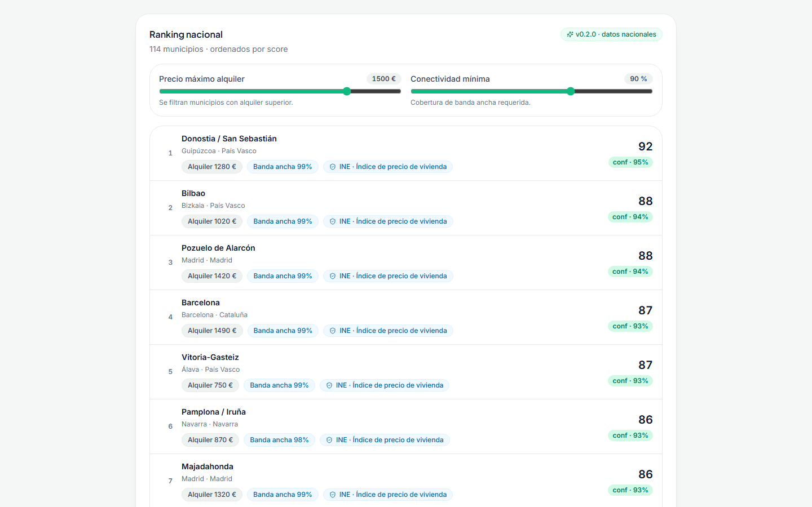
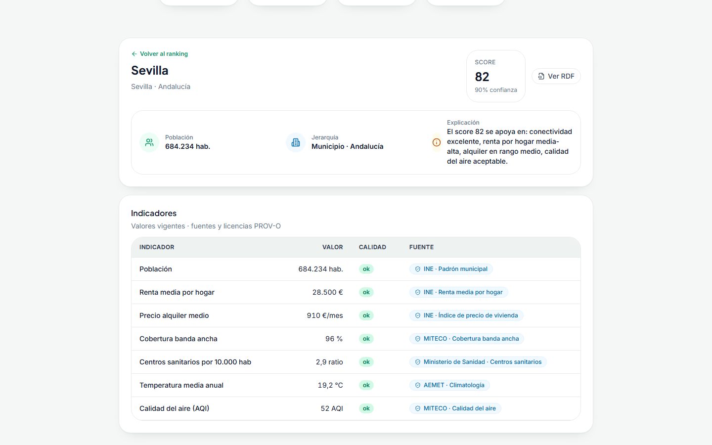
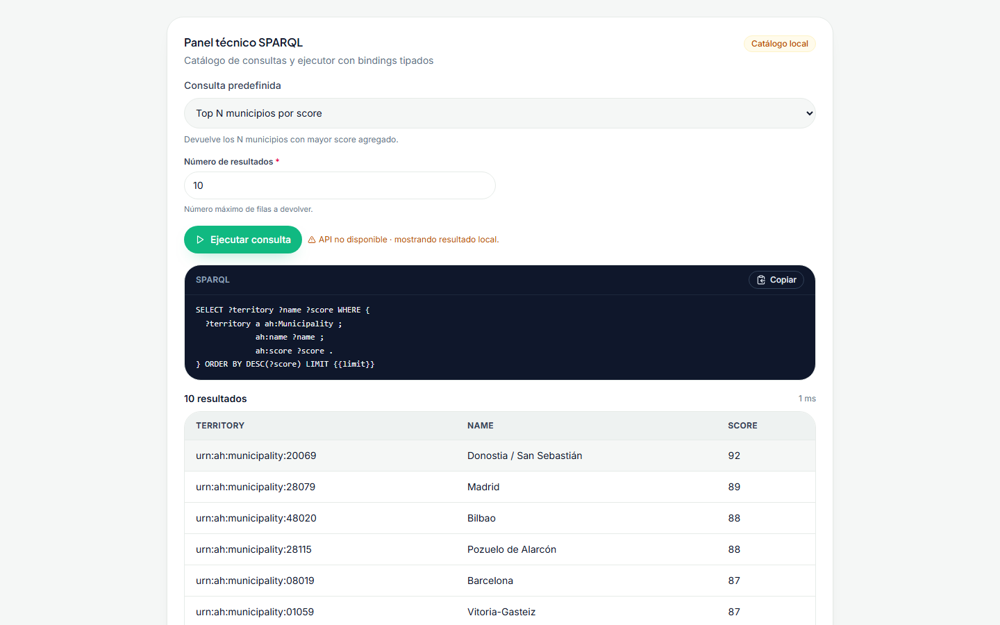

# AtlasHabita

> Plataforma SIG-semantica de recomendacion territorial explicable para Espana. Ingesta datos abiertos oficiales, construye un Knowledge Graph RDF (GeoSPARQL + PROV-O), ejecuta scoring explicable por perfil y expone una experiencia pixel-perfect con mapa, ranking, ficha, SPARQL playground y exportacion RDF.

[](docs/reviews/v0.3.0-audit.md)
[](apps/api/pyproject.toml)
[](https://www.python.org/)
[](https://nodejs.org/)
[](https://pnpm.io/)
[](docs/testing.md)
[](docs/testing.md)
[](docs/adr/0003-stack-tecnologico.md)

AtlasHabita responde a la pregunta "Donde me conviene vivir, estudiar, teletrabajar o emprender en Espana segun lo que valoro?". La plataforma traduce datos abiertos heterogeneos de ocho fuentes oficiales en recomendaciones trazables: cada score se descompone en contribuciones por indicador, cada indicador exhibe su procedencia PROV-O y el grafo RDF es consultable tanto por SPARQL whitelist como por exportacion Turtle/TriG/JSON-LD/NT.

---

## Tabla de contenidos

1. [Capacidades v0.2.0](#capacidades-v020)
2. [Capturas](#capturas)
3. [Stack y arquitectura screaming](#stack-y-arquitectura-screaming)
4. [Requisitos](#requisitos)
5. [Instalacion y ejecucion](#instalacion-y-ejecucion)
6. [Pipeline de datos](#pipeline-de-datos)
7. [Modelo RDF](#modelo-rdf)
8. [API](#api)
9. [UI y accesibilidad](#ui-y-accesibilidad)
10. [Testing](#testing)
11. [Roadmap](#roadmap)
12. [Licencia](#licencia)

---

## Capacidades v0.2.0

Matriz de lo que ya es ejecutable sobre `develop`:

| Area | Capacidad | Estado |
|---|---|---|
| **Datos** | 101 municipios reales (17 capitales de CCAA + 52 capitales de provincia + 32 municipios destacados) distribuidos en todas las CCAA incluyendo Ceuta y Melilla. | completo |
| **Datos** | 8 fuentes oficiales (MIVAU/SERPAVI, INE datos abiertos, INE Atlas de Renta, INE DIRCE, MITECO Reto Demografico demografia y servicios, SETELECO, AEMET). | completo |
| **Datos** | 9 indicadores (`rent_median`, `broadband_coverage`, `income_per_capita`, `services_score`, `climate_comfort`, `population_total`, `age_median`, `household_size`, `enterprise_density`). | completo |
| **Datos** | 909 observaciones municipio x indicador con calidad etiquetada. | completo |
| **Datos** | 4 perfiles de decision (`remote_work`, `family`, `student`, `retire`) con pesos por defecto. | completo |
| **RDF** | Ontologia propia con alineacion **GeoSPARQL** (`geo:Feature`, `geo:hasGeometry`, `geo:asWKT` con CRS84) y **PROV-O** (`ah:IngestionActivity`, `prov:wasGeneratedBy`, `prov:used`). | completo |
| **RDF** | Shapes SHACL obligatorias para `Territory`, `Municipality`, `IndicatorObservation`, `Score`, `IngestionActivity`, `Geometry`. | completo |
| **RDF** | 8 named graphs por dominio (territorios, geometria, indicadores, observaciones, fuentes, procedencia, perfiles, ontologia). | completo |
| **RDF** | Endpoint `POST /sparql` con catalogo whitelist, adaptador Fuseki opcional y stack Docker Compose. | completo |
| **RDF** | Endpoint `GET /rdf/export` (Turtle / TriG / JSON-LD / NT) con streaming y tope defensivo de 16 MB. | completo |
| **Scoring** | Motor explicable (suma ponderada normalizada) con `scoringVersion`, `confidence` y contribuciones por factor. | completo |
| **Scoring** | Filtros duros (alquiler maximo, conectividad minima) en `POST /rankings/custom`. | completo |
| **Mapa** | MapLibre GL con capa coropletica y 6 capas activables (score, renta, alquiler, banda ancha, servicios, clima). | completo |
| **UI** | Ranking paginado (20/pagina) con badge de confianza y sincronizacion con mapa. | completo |
| **UI** | Ficha territorial con jerarquia, tabla de indicadores, chips PROV-O y modal "Ver RDF" paginado. | completo |
| **UI** | SPARQL playground con catalogo local, bindings tipados y fallback offline. | completo |
| **UI** | Motion con GSAP, accesibilidad AA (roles ARIA, focus ring, contraste). | completo |
| **Testing** | Backend: 372/372 tests verdes con cobertura >= 90% en paquetes criticos. | completo |
| **Testing** | Frontend: 127/127 tests Vitest + 3 suites Playwright. | completo |
| **CI** | 10 workflows en verde (`ci-backend`, `ci-frontend`, `ci-build`, `ci-quality`, `ci-security`, `ci-rdf`, `ci-e2e`, `ci-docs`, `ci-codeql`, `ci-trivy`). | completo |

El detalle de la release M8 vive en [`docs/reviews/v0.2.0-release-notes.md`](docs/reviews/v0.2.0-release-notes.md); la auditoria final M9 en [`docs/reviews/v0.3.0-audit.md`](docs/reviews/v0.3.0-audit.md).

---

## Capturas

Las capturas se generan con Playwright en el workflow `ci-e2e` y se almacenan en `docs/screenshots/`. El reemplazo pixel-perfect frente a la referencia de `docs/16_FRONTEND_UX_UI_Y_FLUJOS.md` se documenta en [ADR 0004](docs/adr/0004-pulido-pixel-perfect.md).

### Dashboard principal


### Ranking nacional paginado



### Ficha territorial con PROV-O



### SPARQL playground



---

## Stack y arquitectura screaming

Decisiones consolidadas en [ADR 0002](docs/adr/0002-arquitectura-screaming.md) (arquitectura screaming) y [ADR 0003](docs/adr/0003-stack-tecnologico.md) (stack tecnologico).

### Backend (`apps/api/`)

| Aspecto | Eleccion |
|---|---|
| Lenguaje | Python 3.12 |
| Framework | FastAPI >= 0.115 |
| RDF | RDFLib 7 |
| SHACL | pySHACL |
| Datos tabulares | Pandas + Pydantic v2 |
| HTTP cliente | httpx + tenacity |
| Observabilidad | structlog + request-id |
| Tests | pytest + pytest-asyncio + pytest-cov |
| Lint / format | ruff |
| Tipado estricto | mypy strict |
| Seguridad | bandit, pip-audit |

### Frontend (`apps/web/`)

| Aspecto | Eleccion |
|---|---|
| Bundler | Vite 6 |
| Lenguaje | TypeScript strict |
| UI | React 19 + Tailwind CSS v4 |
| Mapas | MapLibre GL JS + react-map-gl |
| Graficos | Recharts |
| Motion | GSAP (timeline + scroll trigger) |
| Iconos | lucide-react |
| Estado servidor | TanStack Query 5 |
| Estado UI | Zustand 5 |
| Enrutado | React Router v7 |
| Tests unitarios | Vitest + Testing Library + jsdom |
| Tests E2E | Playwright (Chromium) |

### Arbol del repositorio

```text
atlashabita/
|-- apps/
|   |-- api/                            # Backend Python
|   |   `-- src/atlashabita/
|   |       |-- domain/                 # Entidades y politicas puras
|   |       |-- application/            # Casos de uso
|   |       |-- infrastructure/         # Adaptadores RDF, ingesta, HTTP, cache
|   |       |-- interfaces/api/         # Routers FastAPI
|   |       |-- config/                 # Settings tipadas
|   |       `-- observability/          # Logging y errores
|   `-- web/                            # Frontend React 19 + Tailwind v4
|       `-- src/
|           |-- features/               # dashboard, map, ranking, territory, sparql, provenance
|           |-- components/             # primitivas UI (Button, Card, Badge, Pagination, CodeBlock, ...)
|           |-- services/               # clientes API tipados
|           |-- state/                  # Zustand stores
|           |-- hooks/                  # hooks transversales
|           `-- styles/                 # tokens Tailwind v4
|-- data/
|   |-- raw/                            # descargas originales (SHA-256)
|   |-- normalized/                     # parquet/gpkg limpios
|   |-- analytics/                      # indicadores agregados
|   |-- rdf/                            # grafo serializado por named graph
|   |-- reports/                        # reportes de calidad y SHACL
|   `-- seed/                           # dataset demo versionado (cobertura nacional)
|-- ontology/
|   |-- atlashabita.ttl                 # ontologia OWL 2 + alineacion GeoSPARQL / PROV-O
|   `-- shapes.ttl                      # shapes SHACL
|-- docker/                             # Dockerfiles y stack Fuseki
|-- docs/                               # documentacion tecnica y academica
|-- scripts/                            # utilidades reproducibles
`-- .github/                            # workflows CI, templates, CODEOWNERS
```

Detalle completo en [`docs/architecture.md`](docs/architecture.md).

---

## Requisitos

| Herramienta | Version minima | Uso |
|---|---|---|
| Python | 3.12 | Backend, ingesta, RDF. |
| Node.js | 20.11 LTS | Frontend Vite + Playwright. |
| pnpm | 9.15 | Gestor de paquetes del frontend. |
| GNU Make | 4.x | Orquestacion de tareas. |
| Docker + Compose | 24.x | Entorno aislado opcional (incluye profile Fuseki). |

En Windows se recomienda **Git Bash** o **WSL2** para ejecutar `Makefile` y scripts.

---

## Instalacion y ejecucion

Clona el repositorio y coloca la rama de integracion:

```bash
git clone https://github.com/GonxKZ/atllashabita.git
cd atllashabita
git switch develop
```

### Instalacion guiada

```bash
make bootstrap       # Backend (venv + apps/api[dev]) y frontend (pnpm install)
```

### Arranque en desarrollo

```bash
make dev             # Backend en :8000 y frontend en :5173
```

La UI estara en `http://localhost:5173` proxyeando `/api/*` al backend en `http://127.0.0.1:8000`. El endpoint de salud es [`GET /health`](http://127.0.0.1:8000/health) y la documentacion OpenAPI en [`/docs`](http://127.0.0.1:8000/docs).

### Tests

```bash
make test            # pytest backend + vitest frontend
```

### Pipeline RDF

```bash
make rdf             # Reconstruye el grafo desde data/seed/ y valida SHACL
```

### Fuseki (opcional)

```bash
make fuseki-up       # docker compose --profile fuseki up -d fuseki
make fuseki-load     # carga data/rdf/*.ttl en el dataset
make fuseki-down     # detiene y conserva el volumen
```

Consulta [`.env.example`](.env.example) para la lista completa de variables (`ATLASHABITA_SPARQL_BACKEND`, `ATLASHABITA_FUSEKI_BASE_URL`, `VITE_API_BASE_URL`, etc.).

---

## Pipeline de datos

El pipeline se resume en `ingest -> validate -> normalize -> aggregate -> build RDF -> SHACL -> serialize -> consultar`, descrito al detalle en [`docs/data-pipeline.md`](docs/data-pipeline.md).

```mermaid
flowchart LR
    A[8 fuentes oficiales] --> B[Conectores httpx + tenacity]
    B --> C[data/raw/ · SHA-256]
    C --> D[Validacion inicial]
    D --> E[data/normalized/ · parquet/gpkg]
    E --> F[Agregacion territorial]
    F --> G[data/analytics/indicators_by_territory.parquet]
    G --> H[Construccion RDF · rdflib]
    H --> I[SHACL · pyshacl]
    I --> J[data/rdf/*.ttl por named graph]
    J --> K[/sparql + /rdf/export + API de dominio/]
```



Las fuentes oficiales integradas en la Fase A del M8 son:

| Id | Fuente | Licencia | Periodicidad | Indicadores derivados |
|---|---|---|---|---|
| `mivau_serpavi` | MIVAU SERPAVI · alquiler | CC BY 4.0 | anual | `rent_median` |
| `ine_open_data` | INE datos abiertos · indicadores territoriales | CC BY 4.0 | anual | `population_total`, `age_median`, `household_size` |
| `ine_atlas_renta` | INE Atlas de renta de los hogares | CC BY 4.0 | anual | `income_per_capita` |
| `ine_dirce` | INE DIRCE · directorio de empresas | CC BY 4.0 | anual | `enterprise_density` |
| `miteco_reto_demografia` | MITECO Reto Demografico · demografia | CC BY 4.0 | anual | `population_total`, `age_median` |
| `miteco_reto_servicios` | MITECO Reto Demografico · servicios | CC BY 4.0 | anual | `services_score` |
| `seteleco` | SETELECO · banda ancha | CC BY 4.0 | semestral | `broadband_coverage` |
| `aemet` | AEMET · climatologia | AEMET OpenData | anual | `climate_comfort` |

El dataset seed (`data/seed/`) contiene 172 territorios (19 CCAA + 52 provincias + 101 municipios), 909 observaciones y 4 perfiles de decision, suficientes para ejecutar el pipeline y la CI sin conexion a internet.

---

## Modelo RDF

La ontologia vive en [`ontology/atlashabita.ttl`](ontology/atlashabita.ttl) y las shapes en [`ontology/shapes.ttl`](ontology/shapes.ttl). Resumen ejecutivo con ejemplos Turtle y SPARQL en [`docs/rdf-model.md`](docs/rdf-model.md); desarrollo academico en [`docs/11_MODELO_DE_DATOS_RDF_Y_ONTOLOGIA.md`](docs/11_MODELO_DE_DATOS_RDF_Y_ONTOLOGIA.md).

Clases principales:

- `ah:Territory` (subclase de `geo:Feature`) con `ah:AutonomousCommunity`, `ah:Province`, `ah:Municipality`.
- `ah:Indicator`, `ah:IndicatorObservation` (subclase de `prov:Entity`).
- `ah:DataSource` (subclase de `prov:Agent` y `prov:Entity`).
- `ah:IngestionActivity` (subclase de `prov:Activity`).
- `ah:DecisionProfile`, `ah:Score`, `ah:ScoreContribution`.

Ejemplo Turtle con GeoSPARQL + PROV-O:

```turtle
@prefix ah:    <https://data.atlashabita.example/ontology/> .
@prefix ahr:   <https://data.atlashabita.example/resource/> .
@prefix geo:   <http://www.opengis.net/ont/geosparql#> .
@prefix prov:  <http://www.w3.org/ns/prov#> .
@prefix xsd:   <http://www.w3.org/2001/XMLSchema#> .

ahr:territory/municipality/41091
    a ah:Municipality, geo:Feature ;
    rdfs:label "Sevilla"@es ;
    ah:population 684025 ;
    geo:hasGeometry ahr:geometry/municipality/41091 ;
    ah:hasIndicatorObservation ahr:observation/rent_median/municipality/41091/2025 .

ahr:geometry/municipality/41091
    a geo:Geometry, geo:Point ;
    geo:asWKT "<http://www.opengis.net/def/crs/OGC/1.3/CRS84> POINT(-5.9823 37.3886)"^^geo:wktLiteral .

ahr:observation/rent_median/municipality/41091/2025
    a ah:IndicatorObservation, prov:Entity ;
    ah:indicator ahr:indicator/rent_median ;
    ah:value "10.8"^^xsd:decimal ;
    ah:period "2025" ;
    ah:periodYear "2025"^^xsd:gYear ;
    ah:providedBy ahr:source/mivau_serpavi ;
    prov:wasGeneratedBy ahr:activity/mivau_serpavi/2025 .

ahr:activity/mivau_serpavi/2025
    a ah:IngestionActivity, prov:Activity ;
    prov:used ahr:source/mivau_serpavi ;
    prov:generated ahr:observation/rent_median/municipality/41091/2025 .
```

Consultas SPARQL de referencia (top por score, vivienda asequible, indicadores por CCAA, cadena PROV-O) en [`docs/rdf-model.md §8`](docs/rdf-model.md).

---

## API

Catalogo operativo con contratos request/response y codigos de error normalizados en [`docs/api.md`](docs/api.md). Endpoints v0.2.0:

| Metodo | Ruta | Estado | Proposito |
|---|---|---|---|
| GET | `/health` | completo | Heartbeat con nombre, version, entorno y timestamp. |
| GET | `/profiles` · `/profiles/{id}` | completo | Perfiles de decision y pesos por defecto. |
| GET | `/territories/search` | completo | Busqueda textual tolerante a tildes. |
| GET | `/territories/{id}` | completo | Ficha territorial con jerarquia, indicadores y scores. |
| GET | `/territories/{id}/indicators` | completo | Listado detallado de indicadores. |
| GET | `/rankings` | completo | Ranking parametrizado por perfil y ambito. |
| POST | `/rankings/custom` | completo | Ranking con pesos y filtros duros personalizados. |
| GET | `/map/layers` · `/map/layers/{id}` | completo | Catalogo de capas y GeoJSON simplificado. |
| GET | `/sources` · `/sources/{id}` | completo | Catalogo de fuentes, licencia y cobertura. |
| GET | `/rdf/export` | completo | Exportacion Turtle/TriG/JSON-LD/NT en streaming (tope 16 MB). |
| POST | `/sparql` | completo | Ejecuta consulta de catalogo whitelist con bindings tipados. |
| GET | `/sparql/catalog` | completo | Firma publica (query_id, required, optional) del catalogo SPARQL. |
| GET | `/quality/reports` | completo | Reportes de calidad por fuente y ejecucion. |

Errores normalizados: `INVALID_PROFILE`, `INVALID_SCOPE`, `INVALID_WEIGHTS`, `INVALID_FILTER`, `TERRITORY_NOT_FOUND`, `LAYER_NOT_FOUND`, `SOURCE_NOT_FOUND`, `INSUFFICIENT_DATA`, `QUALITY_BLOCKED`, `RATE_LIMITED`, `INVALID_QUERY`, `INVALID_BINDINGS`, `INVALID_FORMAT`, `PAYLOAD_TOO_LARGE`, `INTERNAL_ERROR`. Cada respuesta incluye `error`, `message`, `details`.

---

## UI y accesibilidad

El frontend implementa el lenguaje visual de `docs/16_FRONTEND_UX_UI_Y_FLUJOS.md` con cinco pantallas principales:

| Pantalla | Proposito |
|---|---|
| Dashboard (`/`) | Hero animado, mapa coropletico, recomendaciones destacadas, tendencias por CCAA. |
| Ranking (`/ranking`) | Lista nacional paginada (20/pagina) con filtros duros (precio maximo, conectividad minima) y badge de confianza. |
| Territorio (`/territorio/:id`) | Ficha con cabecera, tabla de indicadores, chips PROV-O y modal "Ver RDF" paginado. |
| SPARQL (`/sparql`) | Panel tecnico con catalogo de consultas, validador tipado y ejecutor con fallback local. |
| Inspector de fuentes | Procedencia, licencia, periodicidad y fecha de ingesta por indicador. |

### Motion con GSAP

Las animaciones viven en `apps/web/src/features/hero/`, `features/recommendations/` y `features/trends/` y se orquestan con una timeline GSAP comun con triggers de scroll. Cumplen con `prefers-reduced-motion`: si el sistema operativo lo solicita, los tweens se resuelven instantaneamente. ADR formal en [`docs/adr/0004-pulido-pixel-perfect.md`](docs/adr/0004-pulido-pixel-perfect.md).

### Accesibilidad AA

- Contraste AA validado con tokens Tailwind v4.
- Roles ARIA explicitos (`role="switch"`, `role="dialog"`, `role="tooltip"`).
- Focus ring visible en todos los primitivos (`Button`, `Toggle`, `Slider`, `Tab`).
- `aria-label` / `aria-live` para estados asincronos.
- Navegacion por teclado garantizada en mapa, ranking, modal RDF y SPARQL playground.
- Respeta `prefers-reduced-motion`.

---

## Testing

La estrategia de pruebas consolidada vive en [`docs/testing.md`](docs/testing.md). Resumen rapido de la piramide actual:

| Capa | Herramienta | Cantidad | Estado |
|---|---|---|---|
| Unitarias backend | pytest + pytest-asyncio + pytest-cov | 372 tests | verde |
| Cobertura backend | coverage.py | >= 90% en paquetes criticos | verde |
| Lint / tipos backend | ruff + mypy strict | | verde |
| Unitarias frontend | Vitest + Testing Library | 127 tests (41 archivos) | verde |
| E2E | Playwright (Chromium) | 5 suites (`home`, `profile-flow`, `ranking`, `territory`, `sparql`) | verde |
| RDF | rdflib parse + pyshacl | | verde |
| Seguridad | bandit + pip-audit + npm audit + CodeQL + Trivy | | verde |

Comandos equivalentes:

```bash
# Backend
pytest apps/api/tests
ruff check apps/api/src apps/api/tests
mypy apps/api/src

# Frontend
pnpm -C apps/web test
pnpm -C apps/web lint
pnpm -C apps/web typecheck
pnpm -C apps/web format:check

# E2E
pnpm -C apps/web e2e

# RDF
python -c "from rdflib import Graph; Graph().parse('ontology/atlashabita.ttl', format='turtle')"
```

---

## Roadmap

Roadmap detallado por milestones con trazabilidad a issues en [`docs/roadmap.md`](docs/roadmap.md). Resumen:

| Milestone | Alcance | Estado |
|---|---|---|
| **M0 · Fundamentos** | ADRs, CODEOWNERS, templates, CI base. | completo |
| **M1 · Infraestructura** | Monorepo, workflows, Docker, Makefile. | completo |
| **M2 · Pipeline RDF base** | Dataset demo, ontologia, shapes, lector seed. | completo |
| **M3 · Calidad avanzada** | Reportes YAML/JSON, named graphs, quality gates en CI. | completo |
| **M4 · Backend FastAPI** | Endpoints de dominio, scoring, RDF export. | completo |
| **M5 · Frontend pixel-a-pixel** | Dashboard, mapa, ranking, ficha, comparador. | completo |
| **M6 · Tests + seguridad** | Cobertura, OWASP, Playwright, Lighthouse. | completo |
| **M7 · Documentacion + release v0.1.0** | README, guias, tag SemVer. | completo |
| **M8 · Ingesta nacional + SPARQL + v0.2.0** | Conectores INE/MITECO, GeoSPARQL + PROV-O, `/sparql`, release v0.2.0. | completo |
| **M9 · Pulido pixel-perfect + v0.3.0** | Pixel-perfect UI, GSAP motion, auditoria final, release v0.3.0. | en curso |

---

## Licencia

Distribuido bajo **licencia MIT** (ver cabeceras de `apps/api/pyproject.toml` y los avisos en cada paquete).

Los datasets demo conservan la atribucion de las fuentes originales segun sus licencias respectivas (CC BY 4.0 para las fuentes INE, MIVAU, MITECO y SETELECO; AEMET OpenData para AEMET). La politica completa vive en [`data/seed/README.md`](data/seed/README.md) y [`SECURITY.md`](SECURITY.md).

**Autor:** Gonzalo Garcia Lama (`gongarlam@alum.us.es`) · Complementos de Bases de Datos · Universidad de Sevilla. AtlasHabita es un proyecto academico; no sustituye a un portal oficial ni constituye asesoramiento profesional, solo ofrece orientacion explicable sobre datos publicos.
