# AtlasHabita

> **Plataforma SIG-semántica de recomendación territorial explicable para España**, construida sobre un Knowledge Graph RDF y un motor de scoring transparente.

[](LICENSE)
[](https://www.python.org/)
[](https://nodejs.org/)
[]()

AtlasHabita convierte datos abiertos heterogéneos del territorio español en decisiones comprensibles mediante un **mapa interactivo**, un **ranking personalizable por perfil** y una **explicación trazable** de cada recomendación. El sistema integra ingesta ETL/ELT, normalización tabular y geoespacial, construcción de un grafo RDF con RDFLib, validación SHACL con pySHACL, scoring explicable y una interfaz React con MapLibre GL.

---

## Tabla de contenidos

1. [Producto y capturas de referencia](#producto-y-capturas-de-referencia)
2. [Arquitectura](#arquitectura)
3. [Stack tecnológico](#stack-tecnológico)
4. [Requisitos previos](#requisitos-previos)
5. [Instalación](#instalación)
6. [Ejecución local](#ejecución-local)
7. [Pipeline de datos](#pipeline-de-datos)
8. [Modelo RDF](#modelo-rdf)
9. [API REST](#api-rest)
10. [Testing](#testing)
11. [Roadmap por fases e issues](#roadmap-por-fases-e-issues)
12. [Flujo GitHub](#flujo-github)
13. [Documentación complementaria](#documentación-complementaria)
14. [Créditos y licencia](#créditos-y-licencia)

---

## Producto y capturas de referencia

AtlasHabita resuelve la pregunta **«¿dónde me conviene vivir, estudiar, teletrabajar o emprender en España según lo que valoro?»**. La interfaz reproduce la captura de referencia incluida en `docs/16_FRONTEND_UX_UI_Y_FLUJOS.md` y se compone de:

| Zona | Contenido |
|---|---|
| Barra lateral (sidebar) | Navegación principal (mapa, ranking, ficha, comparador, inspector de fuentes, modo técnico). |
| Barra superior (topbar) | Selector de perfil activo y botón **«Nuevo análisis»** para reiniciar la sesión. |
| Mapa coroplético | Territorios coloreados por score o capa temática activa (MapLibre GL + GeoJSON). |
| Ranking lateral | Lista ordenada con score, nombre, provincia y factores destacados. |
| Panel de tendencias | Tarjetas con indicadores, comparativas históricas y alertas de calidad. |
| Inspector de fuentes | Procedencia, periodo, licencia y fecha de ingesta por indicador. |

Los flujos principales y los textos de explicación están descritos en [`docs/16_FRONTEND_UX_UI_Y_FLUJOS.md`](docs/16_FRONTEND_UX_UI_Y_FLUJOS.md). Las capturas esperadas para pruebas E2E se documentan en [`apps/web/tests/e2e/fixtures/screenshots.md`](apps/web/tests/e2e/fixtures/screenshots.md).

### Pantallas v0.2.0 (Fase D)

La versión **v0.2.0** amplía la cobertura de producto con datos nacionales mock (>=100 municipios) y tres nuevas rutas:

| Ruta | Descripción |
|---|---|
| `/ranking` | Panel nacional con filtros duros (precio máximo, conectividad mínima), paginación 20 por página y badge de confianza por municipio. |
| `/territorio/:id` | Ficha territorial completa con cabecera, tabla de indicadores, chips PROV-O de procedencia y modal "Ver RDF" con Turtle paginado. |
| `/sparql` | Panel técnico con catálogo de consultas y ejecutor de bindings tipados. Cae en modo *fallback* local si `/sparql` aún no está disponible. |

El panel SPARQL se carga con `React.lazy`; el chunk resultante se emite como artefacto separado (`SparqlPlayground-*.js`) para mantener un bundle inicial bajo el presupuesto definido en `docs/roadmap.md`.

Detalles y rationale en [`docs/reviews/v0.2.0-release-notes.md`](docs/reviews/v0.2.0-release-notes.md).

---

## Arquitectura

El repositorio adopta una **arquitectura screaming por dominios** ([ADR 0002](docs/adr/0002-arquitectura-screaming.md)): el árbol de carpetas expresa el lenguaje del problema (territorios, indicadores, grafo, scoring, fuentes) antes que los frameworks técnicos.

```text
atlashabita/
├── apps/
│   ├── api/                 # Backend Python (FastAPI, RDFLib, pySHACL)
│   │   └── src/atlashabita/
│   │       ├── domain/          # Entidades puras y reglas de negocio
│   │       ├── application/     # Casos de uso
│   │       ├── infrastructure/  # Adaptadores (RDF, filesystem, HTTP)
│   │       ├── interfaces/api/  # Routers FastAPI
│   │       ├── config/          # Configuración tipada
│   │       └── observability/   # Logging estructurado y errores
│   └── web/                 # Frontend React 19 + Tailwind v4
│       └── src/
│           ├── features/        # Dashboard, mapa, ranking, ficha
│           ├── components/      # Primitivas UI
│           ├── services/        # Cliente API tipado
│           ├── state/           # Stores Zustand
│           └── styles/          # Tokens Tailwind v4
├── data/                    # raw/ · normalized/ · analytics/ · rdf/ · seed/
├── ontology/                # atlashabita.ttl, shapes.ttl
├── docs/                    # PRD, SRS, arquitectura, ADR, guías
├── scripts/                 # Utilidades reproducibles
└── .github/                 # CI, templates, CODEOWNERS
```

Detalles completos en [`docs/architecture.md`](docs/architecture.md) y en el documento extendido [`docs/10_ARQUITECTURA_DE_SOFTWARE.md`](docs/10_ARQUITECTURA_DE_SOFTWARE.md).

---

## Stack tecnológico

Decisión consolidada en [ADR 0003](docs/adr/0003-stack-tecnologico.md):

### Backend

| Aspecto | Elección |
|---|---|
| Lenguaje | Python 3.12 |
| Framework web | FastAPI ≥ 0.115 |
| RDF / SPARQL | RDFLib 7 |
| Validación semántica | pySHACL |
| Datos tabulares | Pandas + Pydantic v2 |
| HTTP cliente | httpx + tenacity |
| Logs | structlog |
| Tests | pytest + pytest-cov |
| Lint / formato | ruff |
| Tipado estricto | mypy |

### Frontend

| Aspecto | Elección |
|---|---|
| Bundler | Vite 6 |
| Lenguaje | TypeScript strict |
| UI | React 19 + Tailwind CSS v4 |
| Mapas | MapLibre GL JS + react-map-gl |
| Gráficos | Recharts |
| Estado servidor | TanStack Query 5 |
| Estado UI | Zustand 5 |
| Enrutado | React Router v7 |
| Tests unitarios | Vitest + Testing Library |
| Tests E2E | Playwright |

### Infraestructura

- Makefile con objetivos reproducibles (`bootstrap`, `dev`, `lint`, `test`, `build`, `e2e`).
- Docker Compose opcional para aislar el entorno.
- GitHub Actions: `ci-quality`, `ci-backend`, `ci-frontend`, `ci-build`, `ci-security`, `ci-rdf`, `ci-e2e`, `ci-docs`.

---

## Requisitos previos

| Herramienta | Versión mínima | Uso |
|---|---|---|
| Python | 3.12 | Backend, ingesta, RDF. |
| Node.js | 20.11 LTS | Frontend Vite + Playwright. |
| pnpm | 9.15 | Gestor de paquetes del frontend. |
| GNU Make | 4.x | Orquestación de tareas (opcional pero recomendado). |
| Docker + Compose | 24.x | Entorno aislado (opcional). |

En Windows se recomienda **Git Bash** o **WSL2** para ejecutar el `Makefile` y los scripts.

---

## Instalación

Clona el repositorio y arranca `develop`:

```bash
git clone https://github.com/GonxKZ/atllashabita.git
cd atllashabita
git switch develop
```

### Opción A · Instalación guiada con Make

```bash
make bootstrap       # Backend (.venv + apps/api[dev]) y frontend (pnpm install)
```

### Opción B · Instalación manual

```bash
# Backend
python -m venv .venv
source .venv/bin/activate          # En Windows: .venv\Scripts\activate
pip install --upgrade pip
pip install -e "apps/api[dev]"

# Frontend
cd apps/web
pnpm install --frozen-lockfile
pnpm exec playwright install chromium
cd ../..
```

### Opción C · Docker Compose

```bash
cp .env.example .env
docker compose up --build
```

---

## Ejecución local

### Arranque conjunto

```bash
make dev            # Backend en :8000 y frontend en :5173
```

### Arranque independiente

```bash
make dev-api        # uvicorn atlashabita.interfaces.api:create_app --factory --reload
make dev-web        # pnpm -C apps/web dev
```

La UI estará disponible en `http://localhost:5173` y proxyea `/api/*` al backend en `http://127.0.0.1:8000`. El endpoint de salud es [`GET /health`](http://127.0.0.1:8000/health) y la documentación OpenAPI en [`/docs`](http://127.0.0.1:8000/docs).

### Variables de entorno relevantes

| Variable | Descripción | Valor por defecto |
|---|---|---|
| `ATLASHABITA_ENV` | Entorno lógico (`local`, `dev`, `prod`). | `local` |
| `ATLASHABITA_CORS_ALLOW_ORIGINS` | Orígenes permitidos separados por coma. | `http://localhost:5173` |
| `VITE_API_BASE_URL` | Base URL que el frontend usa para hablar con la API. | `http://127.0.0.1:8000` |
| `E2E_BACKEND` | Si `1`, los tests E2E asumen backend disponible. | `0` |

Consulta [`.env.example`](.env.example) para la lista completa.

---

## Pipeline de datos

El pipeline sigue un flujo `ingest → validate → normalize → build RDF → SHACL → serialize → consultar`, descrito en detalle en [`docs/data-pipeline.md`](docs/data-pipeline.md) y en el documento académico [`docs/12_INGESTA_ETL_ELT_Y_CALIDAD_DE_DATOS.md`](docs/12_INGESTA_ETL_ELT_Y_CALIDAD_DE_DATOS.md).

```mermaid
flowchart LR
    A[Descubrimiento de fuente] --> B[Descarga o lectura]
    B --> C[data/raw/]
    C --> D[Validación inicial]
    D --> E[data/normalized/]
    E --> F[Agregación territorial]
    F --> G[data/analytics/]
    G --> H[Construcción RDF]
    H --> I[Validación SHACL]
    I --> J[data/rdf/*.ttl]
    J --> K[API /rankings · /territories · /sources]
```



El dataset demo (versionado en `data/seed/`) incluye 15 territorios, 5 fuentes, 5 indicadores, 50 observaciones y 3 perfiles que permiten ejecutar todo el pipeline y los tests sin acceso a fuentes externas.

---

## Modelo RDF

La ontología propia reside en [`ontology/atlashabita.ttl`](ontology/atlashabita.ttl) y las restricciones de validación en [`ontology/shapes.ttl`](ontology/shapes.ttl). El resumen ejecutivo con fragmentos y ejemplos SPARQL se encuentra en [`docs/rdf-model.md`](docs/rdf-model.md); el desarrollo completo en [`docs/11_MODELO_DE_DATOS_RDF_Y_ONTOLOGIA.md`](docs/11_MODELO_DE_DATOS_RDF_Y_ONTOLOGIA.md).

Clases principales: `ah:Territory`, `ah:AutonomousCommunity`, `ah:Province`, `ah:Municipality`, `ah:Indicator`, `ah:IndicatorObservation`, `ah:DataSource`, `ah:DecisionProfile`, `ah:Score`, `ah:ScoreContribution`.

```turtle
@prefix ah:  <https://data.atlashabita.example/ontology/> .
@prefix ahr: <https://data.atlashabita.example/resource/> .

ahr:territory/municipality/41091
    a ah:Municipality ;
    dct:identifier "41091" ;
    rdfs:label "Sevilla"@es ;
    ah:belongsTo ahr:territory/province/41 ;
    ah:hasIndicatorObservation ahr:observation/rent_median/41091/2025 .
```

---

## API REST

La API expone recursos versionados bajo el prefijo `/`. Contratos completos con request/response y códigos de error en [`docs/api.md`](docs/api.md) y en el documento académico [`docs/15_BACKEND_API_CONTRATOS_Y_SERVICIOS.md`](docs/15_BACKEND_API_CONTRATOS_Y_SERVICIOS.md).

| Método | Ruta | Estado |
|---|---|---|
| GET | `/health` | completado |
| GET | `/profiles` | ready (fase 4) |
| GET | `/territories/search?q=` | ready (fase 4) |
| GET | `/territories/{id}` | ready (fase 4) |
| GET | `/territories/{id}/indicators` | ready (fase 4) |
| GET | `/rankings` | ready (fase 4) |
| POST | `/rankings/custom` | ready (fase 4) |
| GET | `/map/layers` · `/map/layers/{layer_id}` | ready (fase 4) |
| GET | `/sources` · `/sources/{id}` | ready (fase 4) |
| GET | `/rdf/export` | ready (fase 4) |
| GET | `/quality/reports` | ready (fase 4) |

---

## Testing

La pirámide de pruebas, los comandos por capa y los criterios de aceptación del MVP se recogen en [`docs/testing.md`](docs/testing.md). Resumen rápido:

```bash
# Backend
pytest apps/api/tests                    # Unitarias + integración
ruff check apps/api/src apps/api/tests   # Lint
mypy apps/api/src                        # Tipos

# Frontend
pnpm -C apps/web test                    # Vitest (jsdom)
pnpm -C apps/web lint                    # ESLint
pnpm -C apps/web typecheck               # tsc --noEmit
pnpm -C apps/web format:check            # Prettier

# E2E
pnpm -C apps/web e2e                     # Playwright (Chromium)

# RDF
python -c "from rdflib import Graph; Graph().parse('ontology/atlashabita.ttl', format='turtle')"
```

Los criterios de salida del MVP se definen en [`docs/18_PLAN_DE_PRUEBAS_VALIDACION_Y_CALIDAD.md`](docs/18_PLAN_DE_PRUEBAS_VALIDACION_Y_CALIDAD.md).

---

## Roadmap por fases e issues

El roadmap detallado con milestones, estado y issues asociadas está en [`docs/roadmap.md`](docs/roadmap.md). Resumen por hitos:

| Milestone | Alcance | Estado | Issues destacadas |
|---|---|---|---|
| **M0 · Fundamentos** | ADRs, CODEOWNERS, templates, CI base. | completado | #01, #02, #03 |
| **M1 · Infraestructura y scaffolding** | Monorepo, workflows, Docker, Makefile. | completado | #04, #05, #06, #07 |
| **M2 · Pipeline de datos y RDF** | Dataset demo, ontología, shapes, lector seed. | completado | #08, #09, #10, #11, #12 |
| **M3 · Diseño del sistema de datos** | Validaciones, named graphs, reportes de calidad. | en curso | #13, #14, #15, #16, #17 |
| **M4 · Backend FastAPI** | Endpoints de dominio, scoring, SPARQL, RDF export. | ready | #18, #19, #20 |
| **M5 · Frontend pixel a pixel** | Dashboard, mapa, ranking, ficha, comparador. | ready | #21, #22, #23, #24, #25, #26, #27 |
| **M6 · Tests, CI, seguridad, performance** | Cobertura, OWASP, pip-audit, Playwright completo. | ready | #28, #29, #30, #31, #32, #33 |
| **M7 · Documentación y release** | README, guías E2E, documentos técnicos, release develop→main. | en curso | #34 |

---

## Flujo GitHub

El flujo operativo completo está en [`docs/github-workflow.md`](docs/github-workflow.md) y en [`CONTRIBUTING.md`](CONTRIBUTING.md). Resumen:

1. `main` es estable y protegida; `develop` es la rama de integración.
2. Cada tarea parte de una rama hija con prefijo semántico:
   `feat/issue-<n>-<slug>`, `fix/issue-<n>-<slug>`, `refactor/issue-<n>-<slug>`, `docs/issue-<n>-<slug>`, `test/issue-<n>-<slug>`, `ci/issue-<n>-<slug>`, `chore/issue-<n>-<slug>`.
3. Los commits siguen [Conventional Commits](https://www.conventionalcommits.org/) y son atómicos, sin coautores automáticos.
4. Todas las PR se dirigen a `develop` excepto la release final. Se exige CI en verde y revisión antes del merge.
5. Las ramas **no se borran** al fusionar: sirven de registro histórico.

---

## Documentación complementaria

| Documento | Propósito |
|---|---|
| [`docs/architecture.md`](docs/architecture.md) | Arquitectura screaming, capas y decisiones clave. |
| [`docs/data-pipeline.md`](docs/data-pipeline.md) | Pipeline de datos ingest → RDF. |
| [`docs/rdf-model.md`](docs/rdf-model.md) | Resumen ejecutivo del modelo RDF y SPARQL. |
| [`docs/api.md`](docs/api.md) | Catálogo de endpoints con contratos y errores. |
| [`docs/testing.md`](docs/testing.md) | Pirámide de pruebas y criterios de aceptación. |
| [`docs/roadmap.md`](docs/roadmap.md) | Milestones M0–M7 con estado e issues. |
| [`docs/github-workflow.md`](docs/github-workflow.md) | Reglas operativas del repositorio. |
| [`docs/03_PRD_PRODUCT_REQUIREMENTS_DOCUMENT.md`](docs/03_PRD_PRODUCT_REQUIREMENTS_DOCUMENT.md) | PRD granular del producto. |
| [`docs/04_SRS_SOFTWARE_REQUIREMENTS_SPECIFICATION.md`](docs/04_SRS_SOFTWARE_REQUIREMENTS_SPECIFICATION.md) | SRS del sistema. |
| [`docs/adr/`](docs/adr/) | Architecture Decision Records. |

---

## Créditos y licencia

**Autor:** Gonzalo García Lama · Complementos de Bases de Datos · Universidad de Sevilla.

El proyecto se distribuye bajo **licencia MIT** (ver `pyproject.toml` y cabeceras). Los datasets demo respetan las licencias de las fuentes originales (INE, MIVAU/SERPAVI, MITECO, SETELECO, AEMET); su atribución se conserva en [`data/seed/README.md`](data/seed/README.md).

AtlasHabita es un proyecto académico. No sustituye a un portal oficial ni constituye asesoramiento profesional; ofrece orientación explicable sobre datos públicos.
