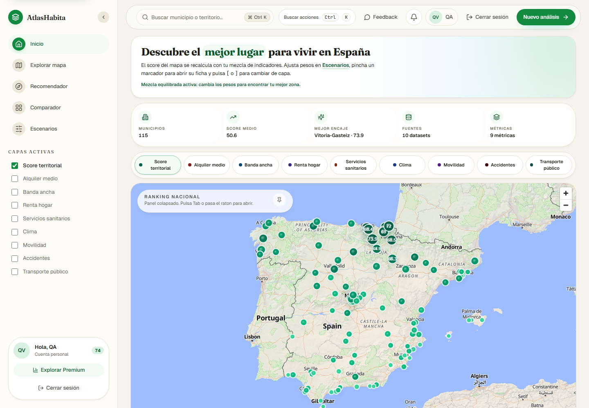

# AtlasHabita

> Plataforma SIG-semantica para decidir donde vivir, estudiar, teletrabajar o
> emprender en Espana combinando datos abiertos oficiales, RDF/RDFLib,
> GeoSPARQL, PROV-O, scoring explicable y una interfaz territorial premium.

[](docs/reviews/v0.5.1-review-cross.md)
[](https://atlashabita.vercel.app)
[](apps/api/pyproject.toml)
[](https://www.python.org/)
[](https://nodejs.org/)
[](https://pnpm.io/)
[](docs/testing.md)
[](docs/testing.md)
[](docs/adr/0003-stack-tecnologico.md)

AtlasHabita convierte datasets publicos heterogeneos en una experiencia
territorial accionable: mapa de Espana, ranking multicriterio, mezcla de
indicadores personalizada, ficha municipal, comparador, playground SPARQL,
exportacion RDF y trazabilidad de fuentes.

**Produccion:** [https://atlashabita.vercel.app](https://atlashabita.vercel.app)



La release actual integra el trabajo de calidad UI, seguridad API y scoring
personalizado:

- `develop`: rama de integracion estable.
- `main`: rama publicada.
- `v0.5.4`: release de despliegue en Vercel con smoke E2E publico.
- Commit funcional principal: `2df5260 feat(ui): personalizar score territorial por indicadores`.
- Merge a `main`: `5e9c4db release: v0.5.2 mezcla personalizada y calidad UI`.

## Contenido

1. [Estado actual](#estado-actual)
2. [Datos y cobertura](#datos-y-cobertura)
3. [Producto y UI](#producto-y-ui)
4. [Arquitectura](#arquitectura)
5. [Instalacion](#instalacion)
6. [Ejecucion local](#ejecucion-local)
7. [Pipeline de datos y RDF](#pipeline-de-datos-y-rdf)
8. [API y seguridad](#api-y-seguridad)
9. [Testing y calidad](#testing-y-calidad)
10. [Flujo Git y release](#flujo-git-y-release)
11. [Limitaciones honestas](#limitaciones-honestas)

## Estado actual

| Area | Estado |
|---|---|
| Frontend React 19 + Vite | Operativo, build de produccion correcto. |
| UI territorial | Dashboard, mapa, ranking, comparador, escenarios, SPARQL y cuenta protegida. |
| Mezcla de indicadores | Los pesos del usuario recalculan ranking y marcadores del mapa en tiempo real. |
| Backend FastAPI | Endpoints de salud, rankings, mapa, fuentes, movilidad, accidentes, transporte, SPARQL y RDF. |
| RDF/RDFLib | Grafo con namespaces propios, GeoSPARQL, PROV-O, SHACL y consultas SPARQL controladas. |
| Seguridad | Cabeceras defensivas, sanitizacion, rate limiting, SPARQL whitelist, limites de exportacion y tests. |
| Tests backend | `493 passed, 1 skipped`, cobertura total `95%`. |
| Tests frontend | `82` suites, `372` tests verdes. |
| Despliegue Vercel | `https://atlashabita.vercel.app` operativo con frontend y API serverless. |
| Release Git | `develop` y `main` publicados; release actual `v0.5.4`. |

## Datos y cobertura

AtlasHabita usa todas las fuentes documentadas disponibles en el repositorio y
en el pipeline reproducible. El proyecto no versiona dumps crudos completos de
cada organismo: versiona un seed nacional determinista y conectores offline /
online para reconstruir artefactos procesados. Esto mantiene los tests
reproducibles y evita subir datasets pesados o cambiantes.

### Fuentes oficiales registradas

`data/seed/sources.csv` contiene 11 fuentes:

| Id | Fuente | Uso principal |
|---|---|---|
| `mivau_serpavi` | MIVAU SERPAVI | Alquiler mediano. |
| `seteleco_broadband_maps` | SETELECO banda ancha | Cobertura de conectividad. |
| `ine_atlas_renta` | INE Atlas de Distribucion de Renta | Renta por territorio. |
| `miteco_reto_demografico_servicios` | MITECO servicios | Servicios municipales. |
| `aemet_opendata` | AEMET OpenData | Confort climatico. |
| `ine_datosabiertos` | INE datos abiertos | Poblacion y hogares. |
| `miteco_reto_demografico_demografia` | MITECO demografia | Edad, poblacion y reto demografico. |
| `ine_dirce` | INE DIRCE | Densidad empresarial. |
| `mitma_movilidad` | MITMA movilidad big data | Flujos origen-destino. |
| `dgt_accidentes` | DGT accidentes | Seguridad vial. |
| `crtm_gtfs` | CRTM Madrid GTFS | Transporte publico metropolitano. |

### Seed versionado

| Archivo | Filas | Uso |
|---|---:|---|
| `territories.csv` | 172 | CCAA, provincias y municipios. |
| `sources.csv` | 11 | Metadatos de procedencia. |
| `indicators.csv` | 12 | Definicion semantica de indicadores. |
| `observations.csv` | 1212 | Observaciones municipio x indicador. |
| `mobility_flows.csv` | 36 | Flujos MITMA agregados. |
| `accidents.csv` | 101 | Accidentes DGT por municipio. |
| `transit_stops.csv` | 19 | Paradas CRTM usadas para transporte. |
| `profiles.csv` | 4 | Perfiles de decision iniciales. |

### Indicadores

El modelo actual puntua y expone:

- `rent_median`
- `broadband_coverage`
- `income_per_capita`
- `services_score`
- `climate_comfort`
- `population_total`
- `age_median`
- `household_size`
- `enterprise_density`
- `mobility_flow`
- `accident_rate`
- `transit_score`

### Pipeline offline validado

El comando:

```bash
python scripts/data_pipeline.py ingest
```

genera artefactos en `data/processed/` desde cache determinista:

| Fuente | Artefacto | Filas validadas |
|---|---|---:|
| INE datos abiertos | `ine_population.csv` | 10 |
| INE Atlas Renta | `ine_income.csv` | 10 |
| INE DIRCE | `ine_enterprises.csv` | 10 |
| MITECO demografia | `miteco_demographic.csv` | 10 |
| MITECO servicios | `miteco_services.csv` | 10 |
| MITMA movilidad | `mitma_movilidad.csv` | 36 |
| DGT accidentes | `dgt_accidentes.csv` | 17 |
| CRTM GTFS | `crtm_transit.csv` | 19 |

Para descarga real externa se usa:

```bash
ATLASHABITA_INGESTION_ONLINE=1 python scripts/data_pipeline.py ingest
```

## Producto y UI

La UI sigue el estilo visual solicitado para AtlasHabita: fondo claro, tarjetas
suaves, verde/turquesa principal, iconografia consistente, mapa central,
paneles laterales, microinteracciones GSAP y densidad visual cuidada.

Flujos principales:

- **Inicio**: mapa territorial, indicadores destacados, capas, ranking flotante
  y feedback visual inmediato.
- **Mapa**: capas multi-metrica para score, alquiler, banda ancha, renta,
  servicios, clima, movilidad, accidentes y transporte.
- **Escenarios**: mezcla de indicadores con sliders y campos porcentuales. El
  ranking cambia al instante y el dashboard refleja la mezcla activa.
- **Ranking**: listado paginado, confianza, score y datos territoriales.
- **Comparador**: seleccion y comparacion de municipios.
- **SPARQL**: consultas predefinidas, bindings tipados y resultados tabulares.
- **Cuenta**: login, registro, cuenta protegida y preferencias locales.

Validacion interactiva reciente con smoke E2E de navegador:

- Feedback abre, valida y registra estado local.
- Notificaciones abre panel real de datasets, API y ranking personalizado.
- `Nuevo analisis` abre SPARQL y ejecuta endpoint.
- Sidebar navega por Inicio, Mapa, Ranking, Comparador y Escenarios.
- Mezcla de indicadores recalcula ranking y mapa.
- Capas del mapa y marcadores abren ficha territorial.
- Cuenta protegida responde con pantalla de login.
- Registro, cierre de sesion e inicio de sesion funcionan sobre la app desplegada.
- Captura principal generada desde Vercel en `docs/screenshots/vercel-atlashabita-home.png`.
- Consola del navegador sin errores de aplicacion durante el recorrido.

## Arquitectura

```text
apps/
  api/
    src/atlashabita/
      domain/              # Modelos puros: territorios, scoring, fuentes, movilidad
      application/         # Casos de uso y scoring explicable
      infrastructure/      # Ingesta, RDF, seguridad, cache, datos
      interfaces/api/      # FastAPI routers, schemas y middleware
      observability/       # Logging, tracing y errores
  web/
    src/
      components/          # UI base y layout
      features/            # dashboard, map, ranking, escenarios, sparql, auth
      services/            # clientes HTTP tipados
      state/               # Zustand stores
      styles/              # tokens visuales y estilos globales
data/
  seed/                    # CSV deterministas versionados
  raw/                     # cache de descargas
  processed/               # salida del pipeline local
  reports/                 # manifiestos y reportes
docs/
ontology/
scripts/
```

Decisiones documentadas:

- [Arquitectura](docs/architecture.md)
- [Pipeline de datos](docs/data-pipeline.md)
- [Modelo RDF](docs/rdf-model.md)
- [API](docs/api.md)
- [Testing](docs/testing.md)
- [ADR stack](docs/adr/0003-stack-tecnologico.md)
- [ADR UI pixel-perfect](docs/adr/0004-pulido-pixel-perfect.md)

## Instalacion

Requisitos:

- Python 3.12
- Node.js 20 LTS
- pnpm 9.15
- Git
- Docker opcional para Fuseki

```bash
git clone https://github.com/GonxKZ/atllashabita.git
cd atllashabita
git switch develop
make bootstrap
```

Si no usas `make`:

```bash
python -m venv .venv
./.venv/Scripts/python.exe -m pip install -e "apps/api[dev]"
cd apps/web
pnpm install
```

## Ejecucion local

Backend:

```bash
./.venv/Scripts/python.exe -m uvicorn atlashabita.interfaces.api:create_app --factory --host 127.0.0.1 --port 8010
```

Frontend:

```bash
cd apps/web
$env:VITE_API_PROXY_TARGET="http://127.0.0.1:8010"
pnpm dev
```

Preview de produccion:

```bash
cd apps/web
pnpm build
pnpm preview --host 127.0.0.1 --port 4173
```

Despliegue de produccion en Vercel:

```bash
npx vercel deploy --prod --yes --scope gonxkz-3021s-projects
```

La configuracion de Vercel vive en `vercel.json` y publica:

- Frontend Vite desde `apps/web/dist`.
- API FastAPI serverless desde `api/index.py`.
- Rewrites `/api/*` hacia la funcion Python.
- Artefactos necesarios de `apps/api/src`, `data/seed` y `ontology`.

## Pipeline de datos y RDF

```bash
python scripts/data_pipeline.py ingest
make rdf
```

El backend incluye:

- `SeedLoader` para leer seed versionado.
- `DatasetBuilder` para integrar conectores.
- RDFLib para construir grafos.
- pySHACL para validacion.
- PROV-O para procedencia.
- GeoSPARQL para geometria.
- SPARQL whitelist para consultas seguras.

## API y seguridad

Endpoints principales:

| Endpoint | Uso |
|---|---|
| `GET /health` | Salud de API. |
| `GET /sources` | Fuentes disponibles. |
| `GET /rankings` | Ranking territorial base. |
| `POST /rankings/custom` | Ranking con pesos y filtros. |
| `GET /map/layers/{id}` | Capa territorial. |
| `GET /territories/{id}` | Ficha territorial. |
| `GET /mobility` | Flujos MITMA. |
| `GET /accidents` | Accidentes DGT. |
| `GET /transit` | Transporte CRTM. |
| `POST /sparql` | Consulta SPARQL controlada. |
| `GET /rdf/export` | Export RDF con limites. |

Controles de seguridad implementados:

- Cabeceras `X-Content-Type-Options`, `X-Frame-Options` y `Referrer-Policy`.
- Rate limiter por cliente real sin confiar en `X-Forwarded-For` salvo proxy
  explicito futuro.
- Sanitizacion de strings, identificadores y parametros.
- SPARQL por catalogo whitelist, sin updates arbitrarios.
- Limites de exportacion RDF.
- Tests de seguridad para sanitizacion, middleware y helpers.
- `bandit -q -r apps/api/src` sin hallazgos.

Auditoria de dependencias:

- `pnpm audit --audit-level high`: sin vulnerabilidades high/critical; reporta
  2 moderate en dependencias frontend.
- `pip-audit`: detecta `CVE-2026-3219` en `pip 26.0.1` del entorno virtual
  local, no en el codigo de AtlasHabita. Para eliminarlo hay que actualizar
  `pip` del venv.

## Testing y calidad

Comandos ejecutados en la validacion de release:

```bash
pnpm lint
pnpm typecheck
pnpm test
pnpm build
node scripts/qa/vercel-smoke.cjs
python scripts/data_pipeline.py ingest
python -m pytest apps/api/tests
python -m ruff check apps/api/src apps/api/tests
python -m mypy apps/api/src
python -m bandit -q -r apps/api/src
pnpm audit --audit-level high
python -m pip_audit
```

Resultados principales:

- Frontend: `82 passed`, `372 tests`.
- Backend: `493 passed`, `1 skipped`, cobertura total `95%`.
- Build Vite: correcto.
- TypeScript strict: correcto.
- ESLint con `--max-warnings 0`: correcto.
- Ruff: correcto.
- Mypy strict: correcto.
- Bandit: correcto.
- Smoke Vercel: home, mapa, Feedback, SPARQL, ranking, comparador, escenarios,
  registro, cierre de sesion, login y captura principal correctos.

Validacion HTTP del despliegue:

```text
GET /                                  200
GET /api/health                        200
GET /api/rankings?profile=remote_work  200
GET /api/territories/search?q=Sevilla  200
GET /login                             200
GET /registro                          200
```

Las respuestas de API incluyen cabeceras defensivas `X-Frame-Options: DENY` y
`X-Content-Type-Options: nosniff`.

## Flujo Git y release

Flujo operativo:

1. Crear rama desde `develop`.
2. Implementar y validar.
3. Commit con Conventional Commits.
4. Push de rama.
5. Integrar en `develop`.
6. Validar `develop`.
7. Merge controlado a `main`.
8. Crear tag anotado.
9. Publicar tag remoto.
10. Borrar ramas ya integradas solo tras confirmacion explicita.

Estado actual tras integracion:

```text
origin/develop -> release v0.5.4 desplegada
origin/main    -> release v0.5.4 desplegada
tag v0.5.4     -> release Vercel final
```

El release `v0.5.4` corresponde al despliegue final en Vercel con smoke E2E y
captura principal versionada.

No se incluyen atribuciones externas en commits, tags ni documentacion. La
configuracion Git local usada es:

```text
GONZALO GARCIA LAMA <gongarlam@alum.us.es>
```

## Limitaciones honestas

- El repositorio usa todos los datasets/fuentes integrados en el pipeline y el
  seed versionado, pero no almacena dumps completos crudos de cada fuente
  publica. Para refresco real se activa `ATLASHABITA_INGESTION_ONLINE=1`.
- CRTM es una fuente metropolitana de Madrid; se usa para enriquecer transporte
  donde hay cobertura disponible.
- El registro e inicio de sesion actuales son locales al navegador mediante
  `localStorage`; no transmiten contrasenas a terceros. Para cuentas multiusuario
  reales debe conectarse un backend de autenticacion persistente.
- Quedan artefactos locales temporales ignorados que no forman parte del release.
