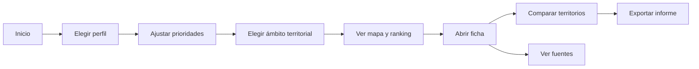

# 08 — Casos de uso e historias de usuario

**Proyecto:** AtlasHabita

## 1. Actores

| Actor | Descripción | Objetivos |
|---|---|---|
| Usuario general | Persona que quiere explorar zonas de España. | Encontrar territorios alineados con prioridades. |
| Estudiante | Usuario con presupuesto y movilidad como factores clave. | Identificar ciudades o barrios para estudiar. |
| Teletrabajador | Usuario que prioriza conectividad y calidad de vida. | Encontrar zonas viables para trabajar en remoto. |
| Familia | Usuario que prioriza servicios, educación, salud y seguridad. | Comparar zonas estables y con servicios. |
| Emprendedor | Usuario que busca oportunidad territorial para negocio. | Evaluar demanda, competencia y coste. |
| Analista técnico | Usuario avanzado o evaluador académico. | Inspeccionar datos, RDF, SPARQL y calidad. |
| Administrador de datos | Persona que ejecuta ingestas y revisa calidad. | Mantener datasets actualizados y válidos. |

## 2. Caso de uso UC-001 — Obtener recomendación territorial

**Actor principal:** Usuario general.  
**Precondición:** Existen datasets normalizados y scores calculables.  
**Flujo principal:**

1. El usuario abre la aplicación.
2. Selecciona un perfil de decisión.
3. Ajusta prioridades y ámbito territorial.
4. El sistema calcula o recupera ranking.
5. El sistema muestra mapa y lista ordenada.
6. El usuario selecciona un territorio.
7. El sistema muestra ficha y explicación.

**Postcondición:** El usuario conoce varias zonas candidatas y sus motivos.

**Excepciones:**

- Si faltan datos críticos, el sistema muestra advertencia.
- Si no hay territorios que cumplan filtros, el sistema sugiere relajar restricciones.

## 3. Caso de uso UC-002 — Comparar territorios

**Actor principal:** Usuario general.  
**Flujo principal:**

1. El usuario marca dos o más territorios.
2. El sistema abre comparador.
3. El comparador muestra indicadores lado a lado.
4. El sistema resalta fortalezas, debilidades y fuentes.
5. El usuario exporta o guarda informe.

## 4. Caso de uso UC-003 — Inspeccionar fuente de un indicador

**Actor principal:** Analista técnico o usuario exigente.  
**Flujo principal:**

1. El usuario abre una ficha territorial.
2. Pulsa sobre un indicador.
3. El sistema muestra fuente, periodo, licencia, fecha de ingesta y transformación.
4. El usuario abre el modo técnico si quiere ver triples RDF o consulta SPARQL relacionada.

## 5. Caso de uso UC-004 — Ejecutar ingesta de datos

**Actor principal:** Administrador de datos.  
**Flujo principal:**

1. El administrador selecciona fuente o grupo de fuentes.
2. El sistema descarga o lee datos en zona raw.
3. El sistema normaliza datos y genera artefactos.
4. El sistema ejecuta validaciones.
5. Si pasa validación, promociona a zona analítica y RDF.
6. Si falla, genera reporte y no publica cambios.

## 6. Historias de usuario principales

| ID | Historia | Criterio de aceptación |
|---|---|---|
| HU-001 | Como estudiante, quiero encontrar zonas con alquiler razonable y buen transporte para decidir dónde estudiar. | Ranking con perfil estudiante y explicación de coste/transporte. |
| HU-002 | Como teletrabajador, quiero filtrar zonas con buena conectividad para evitar lugares inviables. | Filtro de conectividad mínima aplicado antes del ranking. |
| HU-003 | Como familia, quiero comparar zonas por colegios, sanidad y coste para elegir una zona estable. | Comparador muestra esos indicadores con fuentes. |
| HU-004 | Como emprendedor, quiero evaluar una zona para abrir un negocio según demanda y competencia. | Modo negocio muestra oportunidad, competencia y riesgos. |
| HU-005 | Como usuario, quiero saber de dónde sale cada dato para confiar en la recomendación. | Inspector de fuentes accesible desde cada indicador. |
| HU-006 | Como evaluador técnico, quiero ejecutar consultas SPARQL para verificar el Knowledge Graph. | Documento de consultas y endpoint/local graph disponibles. |
| HU-007 | Como administrador, quiero saber si una ingesta ha fallado y por qué. | Reporte de calidad con errores y severidad. |
| HU-008 | Como usuario, quiero entender qué significa un score sin leer fórmulas técnicas. | Explicación en lenguaje natural y contribuciones visuales. |

## 7. Flujo de pantalla principal

