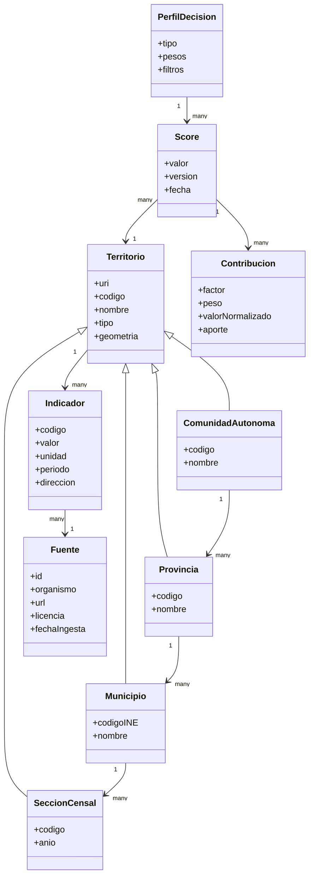

# 09 — Modelo conceptual del dominio

**Proyecto:** AtlasHabita

## 1. Visión del dominio

El dominio de AtlasHabita se organiza alrededor de territorios, indicadores, fuentes, perfiles y recomendaciones. La entidad central es el territorio, porque todo indicador, score y visualización acaba asignándose a un municipio, sección censal, provincia o comunidad autónoma.

## 2. Entidades principales

| Entidad | Descripción | Ejemplos de atributos |
|---|---|---|
| Territorio | Unidad espacial analizable. | id, código INE, nombre, tipo, geometría. |
| Municipio | Territorio administrativo municipal. | código municipio, provincia, comunidad. |
| Provincia | Agrupación administrativa de municipios. | código provincia, comunidad. |
| ComunidadAutónoma | Nivel territorial superior del MVP. | código, nombre. |
| SecciónCensal | Unidad fina de análisis cuando exista dato. | código sección, municipio, geometría, año. |
| Indicador | Medida territorial. | nombre, valor, unidad, periodo, dirección. |
| Fuente | Dataset u organismo origen. | propietario, URL, licencia, fecha de ingesta. |
| PerfilDecision | Configuración de pesos y variables. | tipo, pesos, filtros, umbrales. |
| Score | Resultado calculado para un perfil y territorio. | valor, versión, fecha, contribuciones. |
| PuntoInteres | Entidad geográfica puntual. | tipo, nombre, coordenadas, fuente. |
| CapaMapa | Representación visual de un indicador o score. | leyenda, rango, estilo. |
| EjecucionIngesta | Evento técnico de carga de datos. | fecha, fuente, estado, errores. |

## 3. Relaciones principales

| Relación | Cardinalidad | Explicación |
|---|---|---|
| ComunidadAutónoma contiene Provincia | 1:N | Una comunidad contiene varias provincias. |
| Provincia contiene Municipio | 1:N | Una provincia contiene varios municipios. |
| Municipio contiene SecciónCensal | 1:N | Una sección pertenece a un municipio en un periodo. |
| Territorio tiene Indicador | 1:N | Un territorio puede tener muchos indicadores. |
| Indicador procede de Fuente | N:1 | Varios indicadores pueden proceder de la misma fuente. |
| PerfilDecision produce Score | 1:N | Un perfil genera scores para muchos territorios. |
| Score pertenece a Territorio | N:1 | Cada score se calcula para un territorio. |
| Score tiene Contribución | 1:N | Cada score se descompone en factores. |
| PuntoInteres se ubica en Territorio | N:1 | Los POIs se agregan por territorio. |

## 4. Diagrama conceptual

## 5. Identificadores conceptuales

Los identificadores deben ser estables y no depender de nombres visuales. Un municipio debe identificarse por código normalizado y URI. Un indicador debe identificarse por código de indicador, territorio, periodo y fuente. Un score debe identificarse por territorio, perfil, versión de fórmula y versión de datos.

## 6. Decisiones de modelado

1. El territorio es abstracto porque permite tratar municipios, provincias y secciones con una interfaz común.
2. La fuente es entidad propia porque la trazabilidad es un requisito central.
3. El score no sustituye al indicador: es un resultado derivado.
4. Las contribuciones se modelan explícitamente para explicar recomendaciones.
5. Los puntos de interés pueden almacenarse fuera del RDF si son masivos, pero sus agregados sí deben entrar en el grafo.
