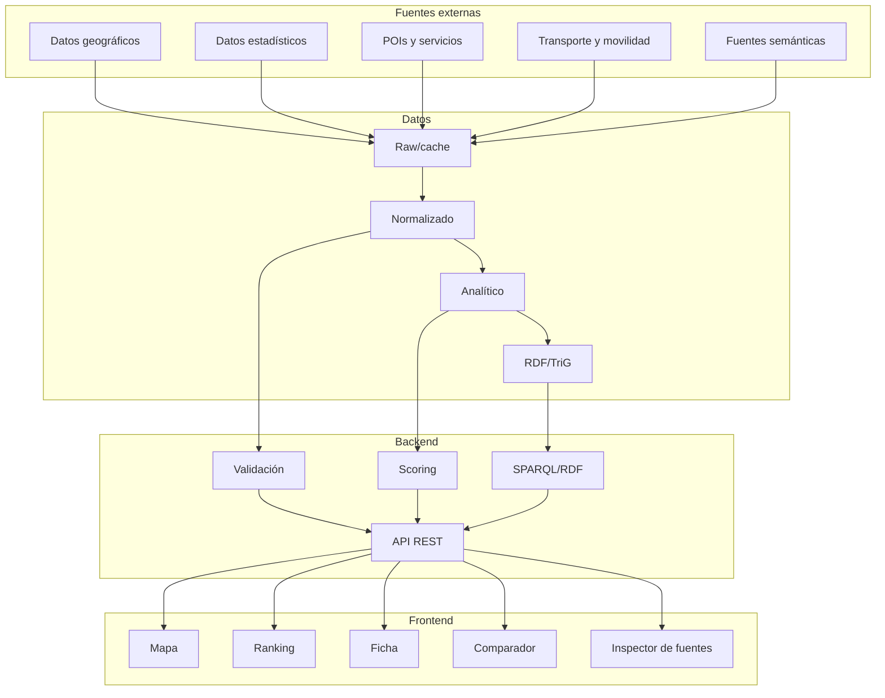

# 10 — Arquitectura de software

**Proyecto:** AtlasHabita

## 1. Estilo arquitectónico

La arquitectura recomendada es una arquitectura por capas y dominios, con separación estricta entre ingesta, normalización, grafo RDF, scoring, API y frontend. El objetivo es evitar que el mapa, el scoring y los datos queden acoplados en un único script.

## 2. Vista de alto nivel



## 3. Capas

| Capa | Responsabilidad | Entrada | Salida |
|---|---|---|---|
| Ingesta | Descargar, cachear o leer fuentes. | URLs, APIs, ficheros. | Datos raw y logs. |
| Normalización | Limpiar, armonizar y validar esquemas. | Datos raw. | Parquet/GeoPackage normalizados. |
| Analítica | Calcular indicadores agregados. | Datos normalizados. | Datasets por territorio. |
| RDF | Construir grafo semántico. | Contratos normalizados. | Turtle/TriG/JSON-LD. |
| Validación | Ejecutar controles tabulares y SHACL. | Normalizados y RDF. | Reportes de calidad. |
| Scoring | Calcular ranking y explicaciones. | Indicadores y perfiles. | Scores y contribuciones. |
| API | Exponer información al frontend. | Servicios internos. | JSON/GeoJSON/JSON-LD. |
| Frontend | Interacción de usuario. | API. | Mapa, ranking, fichas. |

## 4. Estructura de módulos recomendada

```text
src/atlashabita/
  territories/
  datasets/
  ingestion/
  indicators/
  knowledge_graph/
  validation/
  scoring/
  api/
  frontend_adapter/
  reports/
```

## 5. Decisiones arquitectónicas

### DA-001 — Separar datos brutos de RDF

No todos los datos brutos deben convertirse en triples. Las geometrías pesadas, POIs masivos y series grandes deben vivir en almacenes analíticos eficientes. El RDF debe contener entidades, relaciones, procedencia, indicadores agregados y scores.

### DA-002 — Scoring explicable antes que modelo opaco

La primera versión debe usar suma ponderada normalizada, no un modelo de machine learning opaco. Esto facilita explicación, defensa académica y depuración.

### DA-003 — API como frontera entre backend y frontend

El frontend no debe leer directamente ficheros RDF o Parquet. Debe consumir endpoints estables. Esto permite cambiar almacenamiento sin romper la interfaz.

### DA-004 — Validación antes de publicación

La publicación de un dataset, grafo o score debe depender de quality gates. Un error crítico en códigos, geometrías o RDF bloquea la promoción.

## 6. Principios de código

- Alta cohesión por dominio.
- Bajo acoplamiento entre capas.
- Contratos de entrada/salida documentados.
- Funciones puras para scoring y normalización siempre que sea posible.
- Tests cerca de la lógica crítica.
- Configuración separada del código.
- Nombres explícitos y semánticos.

## 7. Riesgos arquitectónicos

| Riesgo | Impacto | Mitigación |
|---|---|---|
| Demasiados datos para el mapa | Alto | Simplificación, teselas, cache y agregados. |
| RDF demasiado grande | Medio | RDF solo para entidades y agregados relevantes. |
| Fuentes externas inestables | Alto | Cache local y datos demo. |
| Scoring poco confiable | Alto | Explicación, pesos visibles y validación manual. |
| Acoplamiento entre ingesta y UI | Alto | API y contratos intermedios. |
