# 12 — Ingesta ETL/ELT y calidad de datos

**Proyecto:** AtlasHabita

## 1. Objetivo

El sistema debe convertir fuentes heterogéneas en datos normalizados, indicadores territoriales y grafo RDF. Para ello se propone una canalización con zonas separadas: raw, cache, normalized, analytics, rdf y reports.

## 2. Pipeline general

```mermaid
flowchart LR
    A[Descubrimiento de fuente] --> B[Descarga o lectura]
    B --> C[Cache raw]
    C --> D[Validación inicial]
    D --> E[Normalización]
    E --> F[Validación de contrato]
    F --> G[Agregación territorial]
    G --> H[Construcción RDF]
    H --> I[Validación SHACL]
    I --> J[Publicación]
```



## 3. Zonas de datos

| Zona | Propósito | Ejemplos |
|---|---|---|
| `raw` | Datos tal como llegan. | ZIP, CSV, JSON, SHP, PBF. |
| `cache` | Respuestas HTTP/API cacheadas. | JSON de API, catálogos. |
| `normalized` | Datos limpios con esquema estable. | Parquet, GeoPackage. |
| `analytics` | Indicadores agregados y listos para scoring. | Tablas por territorio. |
| `rdf` | Grafo RDF serializado. | TTL, TriG, JSON-LD. |
| `reports` | Reportes de calidad y ejecución. | HTML, JSON, Markdown. |

## 4. Fuentes candidatas


| ID | Fuente | Tipo | Entidades | Indicadores esperados | Criticidad |
|---|---|---|---|---|---|
| cnig_limites_admin | IGN/CNIG — límites administrativos | Geoespacial | CCAA, provincia, municipio | Geometrías base | Crítica |
| ine_census_sections_ogc | INE — secciones censales | OGC/geoespacial | Sección censal | Geometrías finas | Crítica |
| ine_open_data | INE Datos Abiertos | Estadística | Municipio, provincia, CCAA | Población, hogares, edad | Alta |
| ine_atlas_renta | INE Atlas de Renta | Estadística | Municipio, distrito, sección | Renta, desigualdad | Crítica |
| mivau_serpavi | Sistema estatal de referencia del alquiler | Vivienda | Sección, distrito, municipio | Precio alquiler | Crítica |
| miteco_reto_demografico_servicios | MITECO Reto Demográfico | Servicios | Municipio | Farmacias, colegios, accesos, internet | Crítica |
| seteleco_broadband_maps | Mapas de banda ancha | Conectividad | Municipio/grid | Fibra, 4G, 5G | Alta |
| sanidad_catalogo_hospitales | Catálogo Nacional de Hospitales | Sanidad | Hospital | Conteo/acceso sanitario | Alta |
| educacion_centros_docentes | Registro de centros docentes | Educación | Centro educativo | Oferta educativa | Alta |
| nap_transport | Punto de Acceso Nacional de Transporte | Transporte | Parada, ruta, operador | Acceso transporte | Alta |
| renfe_data | Renfe Data | Ferroviario | Estación, ruta | Acceso ferroviario | Media |
| osm_geofabrik_spain | OpenStreetMap España | POIs | Amenity, shop, leisure | Servicios, competencia, ocio | Alta |
| dgt_accidentes_victimas | DGT microdatos accidentes | Seguridad vial | Accidente | Riesgo vial | Media |
| dataestur_api | Dataestur | Turismo | Destino turístico | Demanda y oferta turística | Media |
| aemet_opendata | AEMET OpenData | Meteorología | Estación | Clima y alertas | Media |
| siose_land_use | SIOSE | Uso del suelo | Polígono suelo | Suelo urbano/natural | Media |
| catastro_inspire | Catastro INSPIRE | Catastro | Parcela, edificio | Densidad edificatoria | Opcional |
| datosgob_sparql | datos.gob.es SPARQL/API | Catálogo semántico | Dataset, distribución | Calidad metadatos | Media |
| wikidata_sparql | Wikidata Query Service | Linked Open Data | Recurso externo | Equivalencias | Opcional |
| geonames | GeoNames RDF | Linked Open Data | Lugar | Equivalencias | Opcional |


## 5. Contrato de fuente

Cada fuente debe documentarse con:

- Identificador interno.
- Nombre oficial.
- Propietario.
- URL o mecanismo de acceso.
- Tipo de fuente.
- Formatos esperados.
- Entidades producidas.
- Indicadores producidos.
- Periodicidad de revisión.
- Licencia y atribución.
- Riesgos técnicos.

## 6. Validaciones tabulares

| Validación | Ejemplo |
|---|---|
| Columnas obligatorias | `codigo_ine`, `valor`, `periodo`, `fuente`. |
| Tipos | Valor numérico, fecha válida, código como string. |
| Rangos | Score entre 0 y 100, porcentaje entre 0 y 1/100. |
| Unicidad | No duplicar indicador para mismo territorio-periodo-fuente. |
| Nulos | No permitir nulos en claves ni fuente. |
| Cobertura | Porcentaje de municipios con dato. |
| Integridad territorial | Código de municipio existente. |

## 7. Validaciones geoespaciales

- CRS conocido.
- Geometrías válidas.
- Geometrías no vacías.
- Simplificación compatible con mapa.
- Área positiva para polígonos.
- Correspondencia entre código territorial y geometría.

## 8. Validaciones RDF

- URIs válidas.
- Clases obligatorias.
- Etiquetas mínimas.
- Indicadores con valor, unidad, periodo y fuente.
- Scores con perfil y versión.
- Fuentes con metadatos mínimos.
- SHACL sin violaciones críticas.

## 9. Reporte de calidad

Cada ejecución debe producir un reporte con:

```text
fuente: ine_atlas_renta
fecha_ejecucion: 2026-04-24
estado: OK | WARNING | ERROR
filas_raw: 123456
filas_normalizadas: 123100
cobertura_municipal: 0.98
errores_criticos: 0
advertencias: 12
artefactos_generados:
  - data/normalized/income.parquet
  - data/reports/ine_atlas_renta_quality.json
```

## 10. Política de publicación

Un dataset solo puede alimentar el ranking si supera validaciones mínimas. Si una fuente falla, la versión anterior cacheada puede mantenerse, pero debe marcarse como antigua. Si no existe versión anterior, el indicador queda como no disponible y debe reflejarse en la interfaz.
