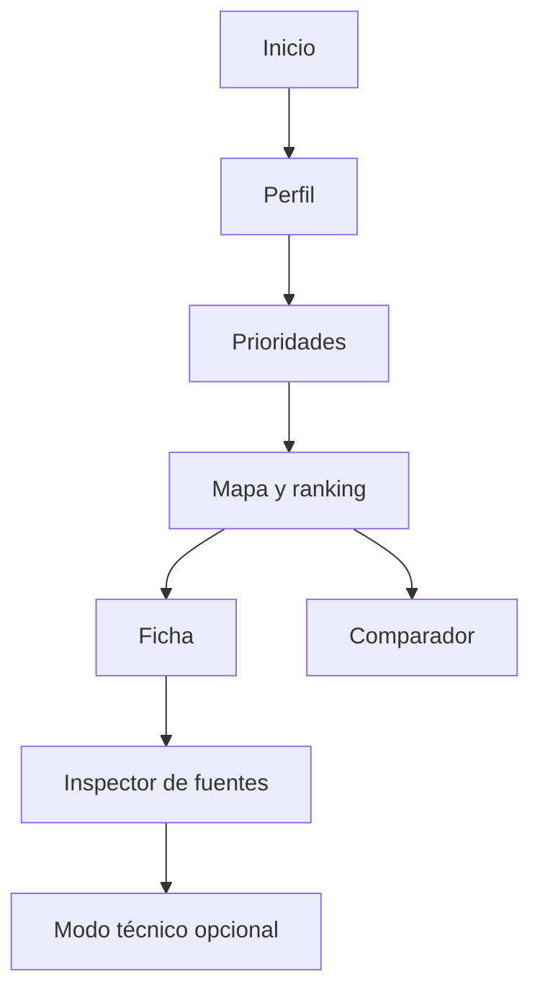

# 16 — Frontend, UX/UI y flujos

**Proyecto:** AtlasHabita

## 1. Principio de experiencia

La experiencia debe convertir datos complejos en decisiones comprensibles. El usuario no debe sentir que está usando una herramienta de análisis estadístico, sino una brújula territorial transparente.

## 2. Pantallas principales

| Pantalla | Objetivo |
|---|---|
| Inicio | Explicar el producto y pedir perfil. |
| Configuración | Ajustar prioridades, ámbito y filtros. |
| Mapa + ranking | Explorar resultados territorialmente. |
| Ficha territorial | Entender un territorio. |
| Comparador | Comparar candidatos. |
| Inspector de fuentes | Ver procedencia y calidad. |
| Modo técnico | Consultas, RDF, SHACL y reportes. |

## 3. Flujo principal



## 4. Componentes UI

| Componente | Función |
|---|---|
| Selector de perfil | Elegir estudiante, familia, teletrabajo, negocio o general. |
| Sliders de peso | Ajustar importancia de variables. |
| Filtros duros | Precio máximo, conectividad mínima, ámbito. |
| Mapa coroplético | Mostrar score o indicador. |
| Ranking lateral | Ordenar y seleccionar territorios. |
| Card territorial | Resumen de territorio. |
| Panel de explicación | Motivos y contribuciones. |
| Tabla de indicadores | Valores, unidades y fuente. |
| Comparador | Columnas por territorio. |
| Badge de calidad | OK, advertencia, incompleto. |

## 5. Wireframe textual

```text
+-------------------------------------------------------------+
| AtlasHabita                              Perfil: Teletrabajo |
+----------------------------+--------------------------------+
| Filtros                    | Mapa                           |
| - Ámbito                   |                                |
| - Pesos                    |     [territorios coloreados]   |
| - Filtros duros            |                                |
+----------------------------+--------------------------------+
| Ranking                                                     |
| 1. Municipio A  86  Conectividad alta, alquiler medio       |
| 2. Municipio B  82  Servicios buenos, entorno natural       |
| 3. Municipio C  79  Muy barato, conectividad aceptable      |
+-------------------------------------------------------------+
| Ficha seleccionada: indicadores, explicación, fuentes        |
+-------------------------------------------------------------+
```

## 6. Texto de explicación recomendado

En lugar de mostrar solo “Score: 84”, la interfaz debe usar explicaciones como:

> Este municipio encaja bien con el perfil de teletrabajo porque combina conectividad alta, servicios cotidianos abundantes y alquiler moderado. La principal penalización es una menor proximidad a transporte ferroviario.

## 7. Estados de interfaz

| Estado | Comportamiento |
|---|---|
| Cargando | Skeleton o spinner con mensaje de contexto. |
| Sin resultados | Explicar qué filtro impide resultados. |
| Datos incompletos | Mostrar advertencia y variables faltantes. |
| Error de fuente | Mantener UI y mostrar que cierta fuente no está disponible. |
| Modo demo | Indicar que se usan datos de demostración. |

## 8. Accesibilidad mínima

- No depender solo del color.
- Texto alternativo para elementos clave.
- Contraste suficiente.
- Botones con etiquetas claras.
- Tablas legibles.
- Mapa complementado con ranking textual.

## 9. Criterio de aceptación UX

Un usuario no técnico debe poder usar la aplicación sin saber qué es RDF, SPARQL, SHACL o ETL. La parte técnica debe existir, pero como capa de transparencia, no como barrera.
