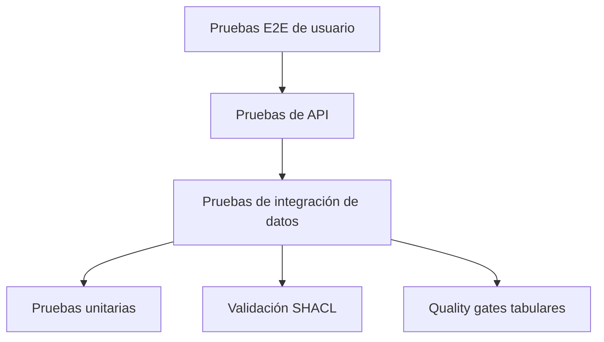

# 18 — Plan de pruebas, validación y calidad

**Proyecto:** AtlasHabita

## 1. Objetivo

El plan de pruebas garantiza que el sistema funciona, que los datos son coherentes, que el grafo RDF es válido, que el scoring es reproducible y que la interfaz permite completar flujos principales.

## 2. Pirámide de pruebas

## 3. Tipos de prueba

| Tipo | Objetivo | Ejemplos |
|---|---|---|
| Unitarias | Probar funciones aisladas. | Normalización, scoring, URI builder. |
| Integración | Probar módulos conectados. | Ingesta + normalización + indicadores. |
| API | Validar contratos. | `/rankings`, `/territories/{id}`. |
| Frontend | Validar flujos. | Perfil → ranking → ficha. |
| Datos | Validar calidad. | Nulos, duplicados, rangos, cobertura. |
| RDF | Validar grafo. | SHACL, consultas SPARQL. |
| Rendimiento | Validar respuesta. | Ranking cacheado, carga mapa. |
| Regresión | Evitar romper funcionalidades. | Scores conocidos en dataset demo. |

## 4. Pruebas unitarias críticas

| ID | Prueba | Resultado esperado |
|---|---|---|
| TU-001 | Normalizar código INE. | Código estable con longitud esperada. |
| TU-002 | Construir URI de municipio. | URI válida y determinista. |
| TU-003 | Normalizar indicador mayor-mejor. | Valor entre 0 y 1. |
| TU-004 | Normalizar indicador menor-mejor. | Valor invertido correctamente. |
| TU-005 | Calcular score ponderado. | Suma correcta de contribuciones. |
| TU-006 | Reescalar pesos ante indicador faltante. | Pesos finales suman 1. |
| TU-007 | Detectar fuente incompleta. | Error de validación. |

## 5. Pruebas de datos

| ID | Validación | Severidad |
|---|---|---|
| TD-001 | Todos los municipios tienen código y nombre. | Crítica |
| TD-002 | No hay indicadores sin fuente. | Crítica |
| TD-003 | No hay valores fuera de rango. | Alta |
| TD-004 | Cobertura municipal mínima por indicador crítico. | Alta |
| TD-005 | Las geometrías no están vacías. | Crítica |
| TD-006 | No hay duplicados de observación. | Alta |

## 6. Pruebas RDF y SPARQL

| ID | Prueba | Resultado esperado |
|---|---|---|
| TRDF-001 | Validar `MunicipalityShape`. | Sin violaciones críticas. |
| TRDF-002 | Consulta municipios por provincia. | Devuelve municipios esperados. |
| TRDF-003 | Consulta fuente de indicador. | Devuelve fuente y título. |
| TRDF-004 | Consulta score por perfil. | Devuelve score y contribuciones. |
| TRDF-005 | Serializar y parsear grafo. | No pierde triples críticos. |

## 7. Pruebas E2E

| ID | Flujo | Resultado esperado |
|---|---|---|
| E2E-001 | Usuario elige teletrabajo y obtiene ranking. | Mapa y ranking visibles. |
| E2E-002 | Usuario abre ficha territorial. | Indicadores y explicación visibles. |
| E2E-003 | Usuario compara tres municipios. | Comparador muestra tabla coherente. |
| E2E-004 | Usuario abre fuente de alquiler. | Panel muestra fuente, periodo y fecha. |
| E2E-005 | Usuario aplica filtro imposible. | UI muestra mensaje de sin resultados. |

## 8. Datos de prueba

Se recomienda crear un dataset demo pequeño con:

- 2 comunidades autónomas.
- 3 provincias.
- 10 municipios.
- 5 indicadores.
- 3 fuentes.
- 3 perfiles.
- geometrías simplificadas.

Este dataset permite probar todo sin depender de descargas externas.

## 9. Criterio de salida

Una versión se puede entregar si:

- Pasan pruebas unitarias críticas.
- Pasan validaciones de datos críticas.
- El RDF cumple SHACL mínimo.
- Los endpoints principales devuelven contratos válidos.
- La demo E2E funciona.
- Los errores conocidos están documentados.
