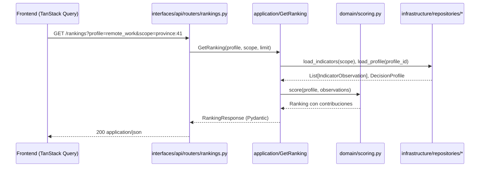

# Arquitectura de AtlasHabita

Este documento consolida las decisiones de arquitectura adoptadas, cómo se traducen a carpetas y módulos y qué flujos existen entre capas. Es el punto de entrada operativo: para la visión académica extendida consulta [`10_ARQUITECTURA_DE_SOFTWARE.md`](10_ARQUITECTURA_DE_SOFTWARE.md); para el contexto de producto, el [PRD](03_PRD_PRODUCT_REQUIREMENTS_DOCUMENT.md).

---

## 1. Principios rectores

1. **Arquitectura screaming**: el árbol de carpetas refleja el dominio del problema (territorios, indicadores, grafo, scoring, fuentes) y no los frameworks. Consolidado en [ADR 0002](adr/0002-arquitectura-screaming.md).
2. **Dominio limpio**: entidades puras y políticas sin dependencias de FastAPI, RDFLib ni infraestructura. Los casos de uso orquestan; los adaptadores implementan.
3. **Frontera estable backend↔frontend**: el frontend nunca lee ficheros RDF ni Parquet. Consume endpoints versionados ([`api.md`](api.md)).
4. **Validación antes de publicación**: un dataset, grafo o score solo se promociona si supera quality gates (tabulares, geoespaciales y SHACL).
5. **Explicabilidad antes que magia**: el scoring es una suma ponderada normalizada con contribuciones visibles, no una caja negra.
6. **Observabilidad desde el día uno**: logging estructurado (structlog), correlación por request-id y errores de dominio con código estable.

---

## 2. Vista de alto nivel

```mermaid
flowchart TB
    subgraph Fuentes externas
      A1[Geoespacial · CNIG/IGN]
      A2[Estadística · INE]
      A3[Vivienda · SERPAVI/MIVAU]
      A4[Servicios · MITECO/SETELECO]
      A5[Transporte · NAP/Renfe]
      A6[POIs · OSM]
      A7[Semánticas · datos.gob.es, Wikidata]
    end

    subgraph Datos (zonas)
      B1[data/raw/]
      B2[data/normalized/]
      B3[data/analytics/]
      B4[data/rdf/]
      B5[data/reports/]
    end

    subgraph Backend (apps/api)
      C1[domain/]
      C2[application/]
      C3[infrastructure/]
      C4[interfaces/api/]
    end

    subgraph Frontend (apps/web)
      D1[features/dashboard]
      D2[features/map]
      D3[features/ranking]
      D4[features/profile]
      D5[features/sources]
    end

    A1 & A2 & A3 & A4 & A5 & A6 & A7 --> B1
    B1 --> B2 --> B3 --> B4
    B2 & B3 & B4 --> C3
    C3 --> C2 --> C1
    C2 --> C4
    C4 --> D1 & D2 & D3 & D4 & D5
    B1 & B2 & B4 --> B5
```

---

## 3. Capas del backend (`apps/api/src/atlashabita/`)

| Capa | Responsabilidad | Depende de | No depende de |
|---|---|---|---|
| `domain/` | Entidades (`Territory`, `Indicator`, `DecisionProfile`), value objects y políticas (`scoring`). | Nada salvo tipado estándar. | FastAPI, RDFLib, filesystem. |
| `application/` | Casos de uso: `GetRanking`, `GetTerritoryProfile`, `BuildKnowledgeGraph`. | `domain/` y puertos abstractos. | Adaptadores concretos. |
| `infrastructure/` | Implementaciones: lectores CSV/Parquet, RDFLib, pySHACL, caché, HTTP. | `domain/`. | `interfaces/`. |
| `interfaces/api/` | Routers FastAPI, serialización Pydantic, manejo de `DomainError`. | `application/` e `infrastructure/`. | Lógica de dominio dentro de rutas. |
| `config/` | `Settings` con `pydantic-settings` y carga de variables `ATLASHABITA_*`. | — | — |
| `observability/` | `configure_logging`, `get_logger`, jerarquía de errores. | structlog. | dominio. |

### Flujo de una petición `/rankings`



---

## 4. Capas del frontend (`apps/web/src/`)

| Carpeta | Propósito |
|---|---|
| `features/dashboard/` | Layout principal con sidebar, topbar y slots para mapa, ranking y ficha. |
| `features/map/` | Renderizado MapLibre, capas coropléticas, leyenda y tooltips. |
| `features/ranking/` | Lista ordenable con score, factores y sincronización con el mapa. |
| `features/profile/` | Selección de perfil, sliders de pesos y filtros duros. |
| `features/sources/` | Inspector de procedencia y calidad. |
| `components/` | Primitivas UI (Button, Card, Badge, Tooltip). |
| `services/` | Cliente tipado frente a la API. |
| `state/` | Stores Zustand (perfil activo, pesos, ámbito). |
| `hooks/` | Hooks transversales (`useRanking`, `useTerritory`, `useSources`). |
| `styles/` | Tokens y utilidades Tailwind v4. |

El estado de servidor vive en TanStack Query (cache, refetch declarativo); el estado efímero de UI en Zustand; la navegación en React Router v7.

---

## 5. Zonas de datos (`data/`)

| Zona | Contenido | Formatos | Permanencia |
|---|---|---|---|
| `raw/` | Descargas originales tal cual llegan. | ZIP, CSV, JSON, SHP, PBF | Corto/medio plazo con hash SHA-256. |
| `normalized/` | Datos limpios con esquema estable. | Parquet, GeoPackage | Versionable. |
| `analytics/` | Indicadores agregados listos para scoring. | Parquet | Versionable. |
| `rdf/` | Grafo RDF serializado por named graph. | Turtle, TriG, JSON-LD | Versionable. |
| `seed/` | Dataset demo versionado en git. | CSV | Versionado. |
| `reports/` | Reportes de calidad por ejecución. | JSON, Markdown, HTML | Auditables. |

---

## 5.bis Estado real v0.2.0 / v0.3.0

A partir de la release v0.2.0 (M8) la arquitectura instanciada presenta los siguientes contadores reales sobre `develop`:

| Dimensión | Cifra |
|---|---|
| Municipios cubiertos en `data/seed/` | 101 |
| Provincias representadas | 52 |
| Comunidades autónomas | 19 (incluye Ceuta y Melilla como CCAA + provincia) |
| Indicadores semánticos definidos | 9 |
| Observaciones municipio × indicador | 909 |
| Perfiles de decisión por defecto | 4 (`remote_work`, `family`, `student`, `retire`) |
| Fuentes oficiales conectadas | 8 (MIVAU SERPAVI, INE datos abiertos, INE Atlas de Renta, INE DIRCE, MITECO Reto Demográfico demografía y servicios, SETELECO, AEMET) |
| Conectores de ingesta operativos | 5 (`mivau_serpavi`, `ine_*`, `miteco_*`, `seteleco`, `aemet`) |
| Endpoints REST publicados | 14 (`/health`, `/profiles*`, `/territories*`, `/rankings*`, `/map/layers*`, `/sources*`, `/rdf/export`, `/sparql`, `/sparql/catalog`, `/quality/reports`) |
| Pantallas frontend con datos reales | Dashboard, Ranking, Territorio, SPARQL playground |
| Tests backend verdes | 372/372 |
| Tests frontend verdes | 127/127 |

La Fase C del M8 incorpora la dualidad SPARQL: el backend rdflib en memoria se complementa con un adaptador Fuseki opcional (`ATLASHABITA_SPARQL_BACKEND=fuseki`) ejecutable vía `make fuseki-up`. El frontend mantiene fallback offline para SPARQL playground y modal "Ver RDF" cuando la API aún no responde, garantizando demos reproducibles aunque el adaptador Fuseki esté apagado.

---

## 6. Decisiones clave

| ID | Decisión | Estado | Referencia |
|---|---|---|---|
| ADR-0001 | Auditoría inicial del repositorio heredado y desbloqueo del flujo. | Aceptado | [adr/0001](adr/0001-auditoria-inicial.md) |
| ADR-0002 | Arquitectura screaming por dominios en apps/api y apps/web. | Aceptado | [adr/0002](adr/0002-arquitectura-screaming.md) |
| ADR-0003 | Stack tecnológico: FastAPI, RDFLib, pySHACL, React 19, Tailwind v4, Vite 6, MapLibre. | Aceptado | [adr/0003](adr/0003-stack-tecnologico.md) |
| ADR-0004 | Pulido pixel-perfect M9: tokens consolidados, motion con GSAP, fallback `prefers-reduced-motion`. | Aceptado | [adr/0004](adr/0004-pulido-pixel-perfect.md) |
| DA-001 | Separar datos brutos de RDF; el grafo contiene entidades, relaciones, procedencia, indicadores agregados y scores. | Aceptado | [10_ARQUITECTURA_DE_SOFTWARE.md §5](10_ARQUITECTURA_DE_SOFTWARE.md) |
| DA-002 | Scoring explicable (suma ponderada normalizada) antes que modelo opaco. | Aceptado | [14_MOTOR_DE_RECOMENDACION_Y_DATA_MINING.md](14_MOTOR_DE_RECOMENDACION_Y_DATA_MINING.md) |
| DA-003 | API como única frontera visible; sin lectura directa de RDF/Parquet desde el frontend. | Aceptado | [15_BACKEND_API_CONTRATOS_Y_SERVICIOS.md](15_BACKEND_API_CONTRATOS_Y_SERVICIOS.md) |
| DA-004 | Validación antes de publicación (quality gates + SHACL). | Aceptado | [12_INGESTA_ETL_ELT_Y_CALIDAD_DE_DATOS.md](12_INGESTA_ETL_ELT_Y_CALIDAD_DE_DATOS.md) |
| DA-005 | Alineación con GeoSPARQL y refuerzo PROV-O en Fase B M8. | Aceptado | [11_MODELO_DE_DATOS_RDF_Y_ONTOLOGIA.md](11_MODELO_DE_DATOS_RDF_Y_ONTOLOGIA.md) |
| DA-006 | `/sparql` whitelist + adaptador Fuseki opcional (Fase C M8). | Aceptado | [api.md §3.10](api.md) |

---

## 7. Flujos transversales

### 7.1 Observabilidad

- `observability/logging.py` configura structlog con formato JSON en `prod` y rich en `local`.
- Cada request recibe `request_id` correlacionado en logs y respuestas de error.
- Los errores de dominio heredan de `DomainError` y se convierten en respuestas `JSONResponse` con `code`, `message`, `details` ([`apps/api/src/atlashabita/interfaces/api/app.py`](../apps/api/src/atlashabita/interfaces/api/app.py)).

### 7.2 Configuración

- `config/settings.py` expone `Settings` (pydantic-settings) leyendo `ATLASHABITA_*` del entorno y `.env`.
- El frontend lee `VITE_API_BASE_URL` y otras variables `VITE_*` en build time.

### 7.3 Seguridad

- CORS restrictivo por defecto (`ATLASHABITA_CORS_ALLOW_ORIGINS`).
- Paginación y límites obligatorios en endpoints de listado (`limit`, `offset`).
- Sin exposición de rutas de ficheros internos.
- Sin SPARQL arbitrario en modo público; consultas predefinidas o sandbox ([`17_SEGURIDAD_PRIVACIDAD_Y_CUMPLIMIENTO.md`](17_SEGURIDAD_PRIVACIDAD_Y_CUMPLIMIENTO.md)).

---

## 8. Riesgos arquitectónicos y mitigaciones

| Riesgo | Impacto | Mitigación |
|---|---|---|
| Geometrías municipales pesadas en el mapa. | Alto | Simplificación previa + teselas por zoom. |
| RDF excesivamente grande. | Medio | Named graphs, solo entidades y agregados semánticos en el grafo. |
| Fuentes externas inestables. | Alto | Cache `data/raw/` + dataset demo `data/seed/` para modo offline. |
| Acoplamiento ingesta↔UI. | Alto | Contratos tipados en `application/` y endpoints estables. |
| Scoring opaco. | Alto | Contribuciones por factor, pesos visibles y tests de regresión sobre dataset demo. |

---

## 9. Referencias

- [ADR 0001 · Auditoría inicial](adr/0001-auditoria-inicial.md)
- [ADR 0002 · Arquitectura screaming](adr/0002-arquitectura-screaming.md)
- [ADR 0003 · Stack tecnológico](adr/0003-stack-tecnologico.md)
- [ADR 0004 · Pulido pixel-perfect](adr/0004-pulido-pixel-perfect.md)
- [10 · Arquitectura de software (extendido)](10_ARQUITECTURA_DE_SOFTWARE.md)
- [15 · Backend, API, contratos y servicios](15_BACKEND_API_CONTRATOS_Y_SERVICIOS.md)
- [16 · Frontend, UX/UI y flujos](16_FRONTEND_UX_UI_Y_FLUJOS.md)
- [api.md · Catálogo de endpoints](api.md)
- [data-pipeline.md · Pipeline de datos](data-pipeline.md)
- [rdf-model.md · Modelo RDF resumido](rdf-model.md)
- [testing.md · Pirámide de pruebas](testing.md)
- [roadmap.md · Milestones M0–M9](roadmap.md)
- [reviews/v0.2.0-release-notes.md · Notas de la release v0.2.0](reviews/v0.2.0-release-notes.md)
- [reviews/v0.3.0-audit.md · Auditoría final v0.3.0](reviews/v0.3.0-audit.md)
