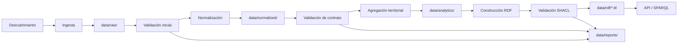

# Pipeline de datos de AtlasHabita

Este documento describe el flujo operativo que convierte fuentes heterogéneas en datasets normalizados, indicadores agregados y grafo RDF listo para SPARQL. Para el tratamiento académico completo consulta [`12_INGESTA_ETL_ELT_Y_CALIDAD_DE_DATOS.md`](12_INGESTA_ETL_ELT_Y_CALIDAD_DE_DATOS.md); para el modelo semántico resultante, [`rdf-model.md`](rdf-model.md).

---

## 1. Flujo general



Cada flecha del diagrama corresponde a un caso de uso en `apps/api/src/atlashabita/application/`; los adaptadores concretos viven en `apps/api/src/atlashabita/infrastructure/ingestion/` y `infrastructure/knowledge_graph/`.

---

## 2. Etapas del pipeline

### 2.1 Ingesta

- Entrada: contrato de fuente con `id`, URL o fichero, tipo, licencia y periodicidad ([`12_INGESTA_ETL_ELT_Y_CALIDAD_DE_DATOS.md §5`](12_INGESTA_ETL_ELT_Y_CALIDAD_DE_DATOS.md)).
- Salida: fichero en `data/raw/<id>/<yyyy-mm-dd>/` con hash SHA-256 y metadatos JSON.
- Reintentos idempotentes con `httpx + tenacity`.
- Para desarrollo offline se usa el dataset demo de `data/seed/` leído por [`apps/api/src/atlashabita/infrastructure/ingestion/seed_loader.py`](../apps/api/src/atlashabita/infrastructure/ingestion/seed_loader.py).

#### Fuentes oficiales y conectores

A partir de la Fase A del M8 hay cinco conectores Python reales operativos sobre ocho fuentes oficiales:

| Conector | Fuente | URL pública | Indicadores derivados |
|---|---|---|---|
| `MivauSerpaviConnector` | MIVAU SERPAVI · alquiler | https://www.mivau.gob.es/vivienda/alquiler/serpavi | `rent_median` |
| `IneOpenDataConnector` | INE datos abiertos · indicadores | https://www.ine.es/dyngs/INEbase | `population_total`, `age_median`, `household_size` |
| `IneAtlasRentaConnector` | INE Atlas de renta de los hogares | https://www.ine.es/experimental/atlas/exp_atlas_tab.htm | `income_per_capita` |
| `IneDirceConnector` | INE DIRCE · directorio de empresas | https://www.ine.es/dyngs/INEbase | `enterprise_density` |
| `MitecoRetoDemograficoConnector` | MITECO Reto Demográfico · demografía y servicios | https://www.miteco.gob.es/es/reto-demografico | `population_total`, `age_median`, `services_score` |
| `SetelecoConnector` | SETELECO · banda ancha | https://avancedigital.mineco.gob.es | `broadband_coverage` |
| `AemetConnector` | AEMET OpenData · climatología | https://opendata.aemet.es | `climate_comfort` |

Todos comparten un `HttpDownloader` con cache local y reintentos exponenciales. La orquestación (`DatasetBuilder`) deduplica indicadores cuando varias fuentes proporcionan la misma señal y registra una `IngestionActivity` PROV-O por tupla `(source, period)`.

### 2.2 Validación inicial

- Comprueba tamaño, hash, formato y codificación.
- Detecta cambios de esquema contra el contrato esperado.
- Resultado: `data/reports/<id>/ingestion_<timestamp>.json` con estado `OK | WARNING | ERROR`.

### 2.3 Normalización

- Armoniza códigos territoriales (INE) y nombres (`python-slugify`).
- Normaliza CRS a EPSG:4326 y simplifica geometrías.
- Emite Parquet/GeoPackage en `data/normalized/<dominio>.parquet`.

Validaciones tabulares aplicadas (resumen):

| Validación | Ejemplo |
|---|---|
| Columnas obligatorias | `codigo_ine`, `valor`, `periodo`, `fuente`. |
| Tipos | numérico, fecha, código como string. |
| Rangos | score ∈ [0, 100]; porcentaje ∈ [0, 1] o [0, 100]. |
| Unicidad | no duplicar `(indicador, territorio, periodo, fuente)`. |
| Nulos | prohibidos en claves y fuente. |
| Cobertura | % de municipios con dato por indicador crítico. |
| Integridad territorial | el código debe existir en la dimensión territorios. |

Validaciones geoespaciales:

- CRS conocido y transformado si hace falta.
- Geometrías no vacías y con área positiva para polígonos.
- Correspondencia `codigo_territorial ↔ geometria`.
- Simplificación compatible con el nivel de zoom objetivo del mapa.

### 2.4 Agregación territorial

- Combina fuentes para obtener indicadores por territorio y periodo.
- Resultado: `data/analytics/indicators_by_territory.parquet` con columnas `(indicator_id, territory_id, period, value, unit, quality_flag, source_id)`.
- Estas tablas alimentan el scoring y los endpoints `/territories/{id}/indicators` y `/rankings`.

### 2.5 Construcción RDF

- Adaptador `rdflib.Graph` por named graph (ver sección 4).
- Política de URIs estable:

```text
https://data.atlashabita.example/resource/territory/municipality/{codigo_ine}
https://data.atlashabita.example/resource/territory/province/{codigo_provincia}
https://data.atlashabita.example/resource/indicator/{codigo_indicador}
https://data.atlashabita.example/resource/source/{id_fuente}
https://data.atlashabita.example/resource/profile/{id_perfil}
https://data.atlashabita.example/resource/score/{version}/{perfil}/{territorio}
```

- Serialización por named graph a `data/rdf/<graph>.ttl`.

### 2.6 Validación SHACL

- `pyshacl.validate(data_graph, shacl_graph, inference='rdfs')` frente a [`ontology/shapes.ttl`](../ontology/shapes.ttl).
- Un incumplimiento de severidad `Violation` bloquea la publicación (`data/reports/shacl_<timestamp>.json`).
- Los `Warning` se conservan en el reporte pero no bloquean.

### 2.7 Publicación

- El grafo se publica si y solo si:
  1. Validaciones tabulares críticas pasan.
  2. Validaciones geoespaciales críticas pasan.
  3. SHACL sin violaciones críticas.
- Si falla, se mantiene la versión previa cacheada marcada como *antigua* y la UI muestra aviso.

---

## 3. Zonas de datos y retención

| Zona | Ruta | Contenido | Retención |
|---|---|---|---|
| Raw | `data/raw/` | Descargas originales | Hasta la siguiente ingesta exitosa + 1. |
| Normalizado | `data/normalized/` | Parquet/GeoPackage limpios | Versiones semánticas por dataset. |
| Analítico | `data/analytics/` | Indicadores por territorio | Última versión + histórico trimestral. |
| RDF | `data/rdf/` | Turtle por named graph | Última versión publicada + previa. |
| Reportes | `data/reports/` | Calidad y SHACL | 12 meses. |
| Seed | `data/seed/` | Dataset demo versionado | Siempre presente para desarrollo/tests. |

---

## 4. Named graphs

Se separan por dominio para auditar, actualizar y consultar independientemente ([`11_MODELO_DE_DATOS_RDF_Y_ONTOLOGIA.md §10`](11_MODELO_DE_DATOS_RDF_Y_ONTOLOGIA.md)):

| Named graph | Contenido |
|---|---|
| `ahg:territories` | Jerarquía administrativa y geometrías resumidas. |
| `ahg:socioeconomic` | Renta, desempleo, educación. |
| `ahg:housing` | Alquiler, vivienda, accesibilidad residencial. |
| `ahg:mobility` | Transporte, estaciones, cobertura. |
| `ahg:services` | Sanidad, educación, servicios básicos. |
| `ahg:sources` | Metadatos y procedencia. |
| `ahg:scores` | Scores calculados por perfil y versión. |

---

## 5. Dataset demo (`data/seed/`)

A partir de la Fase A del M8 el dataset cubre toda la geografía española y vive en `data/seed/` (ver [`data/seed/README.md`](../data/seed/README.md)). Sigue versionado para que el pipeline funcione sin conexión y los tests sean deterministas:

| Archivo | Contenido | Filas |
|---|---|---|
| `territories.csv` | 19 CCAA (17 + Ceuta y Melilla) + 52 provincias + 101 municipios con centroides y población. | 172 |
| `sources.csv` | 8 fuentes oficiales con URLs reales (MIVAU SERPAVI, INE datos abiertos, INE Atlas de Renta, INE DIRCE, MITECO Reto Demográfico demografía y servicios, SETELECO, AEMET). | 8 |
| `indicators.csv` | 9 indicadores semánticos: `rent_median`, `broadband_coverage`, `income_per_capita`, `services_score`, `climate_comfort`, `population_total`, `age_median`, `household_size`, `enterprise_density`. | 9 |
| `observations.csv` | Observaciones municipio × indicador (101 × 9). | 909 |
| `profiles.csv` | Perfiles de decisión: `remote_work`, `family`, `student`, `retire`. | 4 |

Los conectores reales viven en `apps/api/src/atlashabita/infrastructure/ingestion/` y se orquestan con `DatasetBuilder`. Para repetir la descarga real basta con `ATLASHABITA_INGESTION_ONLINE=1 python scripts/data_pipeline.py ingest`. El lector offline está en [`seed_loader.py`](../apps/api/src/atlashabita/infrastructure/ingestion/seed_loader.py) y cachea el dataset con `lru_cache` por configuración.

---

## 6. Reportes de calidad

Formato canónico (YAML/JSON) generado en cada ejecución:

```yaml
fuente: ine_atlas_renta
fecha_ejecucion: 2026-04-24T08:15:00Z
estado: OK
filas_raw: 123456
filas_normalizadas: 123100
cobertura_municipal: 0.98
errores_criticos: 0
advertencias: 12
artefactos_generados:
  - data/normalized/income.parquet
  - data/reports/ine_atlas_renta_quality.json
```

---

## 7. Reproducibilidad

- Cada ejecución registra versión de scoring, hash de entrada y hash de salida.
- `scripts/` contiene utilidades deterministas (sin dependencias vivas).
- El workflow `ci-rdf.yml` reconstruye el grafo en CI usando `data/seed/` y valida SHACL.

---

## 8. Referencias

- [12 · Ingesta ETL/ELT y calidad de datos](12_INGESTA_ETL_ELT_Y_CALIDAD_DE_DATOS.md)
- [11 · Modelo RDF y ontología](11_MODELO_DE_DATOS_RDF_Y_ONTOLOGIA.md)
- [rdf-model.md · Modelo RDF resumido](rdf-model.md)
- [api.md · Endpoints que consumen el pipeline](api.md)
- [testing.md · Validaciones y quality gates en la pirámide de pruebas](testing.md)
