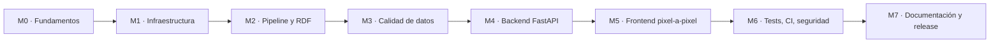

# Roadmap de AtlasHabita

Plan de entrega por milestones, con estado y trazabilidad a issues. El flujo operativo que rige la creación de ramas y PRs se describe en [`github-workflow.md`](github-workflow.md) y [`CONTRIBUTING.md`](../CONTRIBUTING.md).

Leyenda de estado:

| Símbolo | Significado |
|---|---|
| `completado` | Fusionado en `develop` y verificado en CI. |
| `en curso` | Hay ramas activas trabajando sobre la milestone. |
| `ready` | Especificado, con issues abiertas y pendiente de implementación. |
| `futuro` | Fuera del alcance del MVP; propuesta post-defensa. |

---

## Visión general

---

## M0 · Fundamentos

**Estado:** `completado`

- ADRs iniciales, CODEOWNERS, plantillas de issue/PR, `CONTRIBUTING.md`.
- Workflows base de CI (quality, security, docs).

Issues asociadas:

| Issue | Título | Estado |
|---|---|---|
| #1 | Auditoría inicial y plan de ejecución. | completado |
| #2 | Crear `develop`, labels y milestones. | completado |
| #3 | Plantillas de issue, PR y CODEOWNERS. | completado |

Entregables:

- [`docs/adr/0001-auditoria-inicial.md`](adr/0001-auditoria-inicial.md)
- [`docs/adr/0002-arquitectura-screaming.md`](adr/0002-arquitectura-screaming.md)
- [`docs/adr/0003-stack-tecnologico.md`](adr/0003-stack-tecnologico.md)
- [`docs/github-workflow.md`](github-workflow.md)

---

## M1 · Infraestructura y scaffolding

**Estado:** `completado`

- Monorepo `apps/api` + `apps/web`.
- Backend FastAPI con dominio limpio, `/health` y observabilidad.
- Frontend Vite + React 19 + Tailwind v4 + Vitest.
- Docker Compose, Makefile, `.env.example`.
- CI completa por áreas (`ci-backend`, `ci-frontend`, `ci-build`, `ci-rdf`, `ci-e2e`, `ci-docs`).

Issues asociadas:

| Issue | Título | Estado |
|---|---|---|
| #4 | Scaffolding del monorepo y CI completa. | completado |
| #5 | Backend inicial con dominio limpio y `/health`. | completado |
| #6 | Frontend inicial con Vite + Tailwind v4. | completado |
| #7 | Infra: Makefile, Compose, `.env.example`. | completado |

---

## M2 · Pipeline de datos y RDF base

**Estado:** `completado`

- Dataset demo versionado (`data/seed/`).
- Ontología `ontology/atlashabita.ttl` y shapes `ontology/shapes.ttl`.
- Lector seed (`seed_loader.py`).

Issues asociadas:

| Issue | Título | Estado |
|---|---|---|
| #8 | Dataset demo, ontología y lector seed. | completado |
| #9 | Shapes SHACL mínimas. | completado |
| #10 | Política de URIs y named graphs documentada. | completado |
| #11 | Validación RDF en CI. | completado |
| #12 | Infraestructura RDF (rdflib + pyshacl). | completado |

---

## M3 · Diseño del sistema de datos (calidad avanzada)

**Estado:** `en curso`

- Validaciones tabulares y geoespaciales con reportes persistentes.
- Named graphs operativos con particiones por dominio.
- Reporte consolidado de calidad.

Issues asociadas:

| Issue | Título | Estado |
|---|---|---|
| #13 | Validaciones tabulares con reporte YAML/JSON. | en curso |
| #14 | Validaciones geoespaciales (CRS, topología, simplificación). | ready |
| #15 | Particionado por named graphs y exportación TriG. | ready |
| #16 | Reporte consolidado de calidad. | ready |
| #17 | Quality gates en CI (`ci-rdf` ampliado). | ready |

---

## M4 · Backend FastAPI con dominio limpio

**Estado:** `ready`

- Endpoints de dominio: perfiles, territorios, rankings, capas, fuentes, RDF.
- Scoring explicable con contribuciones.
- SPARQL endpoints internos predefinidos.

Issues asociadas:

| Issue | Título | Estado |
|---|---|---|
| #18 | `GET /profiles` y `GET /territories`. | ready |
| #19 | `GET /rankings` y `POST /rankings/custom`. | ready |
| #20 | `GET /map/layers` y `GET /sources`. | ready |

Referencias: [`api.md`](api.md), [`15_BACKEND_API_CONTRATOS_Y_SERVICIOS.md`](15_BACKEND_API_CONTRATOS_Y_SERVICIOS.md).

---

## M5 · Frontend pixel a pixel

**Estado:** `ready`

- Sistema de diseño derivado de la captura de referencia.
- Sidebar, topbar con "Nuevo análisis", mapa, ranking y panel de tendencias.
- Estados: cargando, vacío, error, datos incompletos, modo demo.

Issues asociadas:

| Issue | Título | Estado |
|---|---|---|
| #21 | Sistema de diseño y tokens Tailwind v4. | ready |
| #22 | Design system shell (sidebar + topbar). | ready |
| #23 | Mapa MapLibre y capas coropléticas. | ready |
| #24 | Ranking lateral sincronizado con el mapa. | ready |
| #25 | Ficha territorial con indicadores y explicación. | ready |
| #26 | Inspector de fuentes. | ready |
| #27 | Integración frontend con API. | ready |

Referencias: [`16_FRONTEND_UX_UI_Y_FLUJOS.md`](16_FRONTEND_UX_UI_Y_FLUJOS.md).

---

## M6 · Tests, CI, seguridad y performance

**Estado:** `ready`

- Cobertura de tests unitarios y de integración por encima del 70 %.
- OWASP Top 10 revisado para la API.
- Playwright con cobertura del flujo principal.
- Benchmark ligero con datos demo.

Issues asociadas:

| Issue | Título | Estado |
|---|---|---|
| #28 | Cobertura backend ≥ 70 %. | ready |
| #29 | Cobertura frontend ≥ 60 %. | ready |
| #30 | `bandit`, `pip-audit`, `npm audit` estrictos. | ready |
| #31 | Playwright para E2E-001..E2E-005. | ready |
| #32 | Lighthouse/k6 smoke. | ready |
| #33 | Revisión OWASP Top 10. | ready |

Referencias: [`testing.md`](testing.md), [`18_PLAN_DE_PRUEBAS_VALIDACION_Y_CALIDAD.md`](18_PLAN_DE_PRUEBAS_VALIDACION_Y_CALIDAD.md).

---

## M7 · Documentación final y release

**Estado:** `en curso`

- README exhaustivo.
- Guías `architecture.md`, `data-pipeline.md`, `rdf-model.md`, `api.md`, `testing.md`, `roadmap.md`.
- Playwright E2E `home.spec.ts` y `profile-flow.spec.ts`.
- Release final: PR `develop → main` con tag SemVer y release notes.

Issues asociadas:

| Issue | Título | Estado |
|---|---|---|
| #34 | Documentación final y guía E2E. | en curso |

---

## Futuro (fuera del MVP)

| Tema | Descripción |
|---|---|
| Modo técnico avanzado | SPARQL console con sandbox. |
| Multi-tenant | Perfiles guardados por usuario. |
| Cobertura internacional | Extender más allá de España. |
| Machine learning complementario | Clustering de territorios similares. |
| Accesibilidad AAA | Auditoría WCAG 2.2 completa. |

---

## Referencias cruzadas

- [`architecture.md`](architecture.md)
- [`data-pipeline.md`](data-pipeline.md)
- [`rdf-model.md`](rdf-model.md)
- [`api.md`](api.md)
- [`testing.md`](testing.md)
- [`github-workflow.md`](github-workflow.md)
- [`CONTRIBUTING.md`](../CONTRIBUTING.md)
