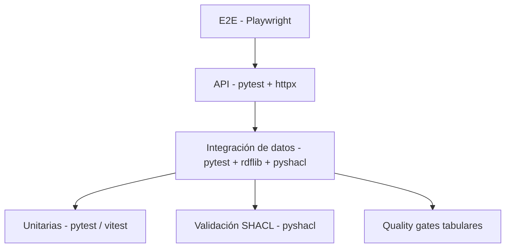

# Estrategia de pruebas de AtlasHabita

Este documento consolida la pirámide de pruebas, cómo se ejecutan por capa y los criterios de aceptación del MVP. Complementa el documento académico [`18_PLAN_DE_PRUEBAS_VALIDACION_Y_CALIDAD.md`](18_PLAN_DE_PRUEBAS_VALIDACION_Y_CALIDAD.md).

---

## 1. Pirámide de pruebas



Regla de pulgar: muchas unitarias, algunas de integración, pocas de E2E. Los tiempos de CI deben mantener cada workflow por debajo de 5 minutos.

---

## 2. Capas y cómo se ejecutan

### 2.1 Unitarias · Backend

- Herramienta: `pytest`, `pytest-cov`.
- Alcance: entidades de dominio, reglas de scoring, URI builder, normalización.
- Ejecución:

```bash
pytest apps/api/tests
ruff check apps/api/src apps/api/tests
mypy apps/api/src
```

- Cobertura mínima exigida (`pyproject.toml`): **70 % de líneas** en `atlashabita/`.

### 2.2 Unitarias · Frontend

- Herramienta: `vitest` + `@testing-library/react` + `jsdom`.
- Alcance: componentes de UI, hooks puros, store Zustand, servicios con `MSW` (cuando aplique).
- Ejecución:

```bash
pnpm -C apps/web test
pnpm -C apps/web test:coverage
pnpm -C apps/web lint
pnpm -C apps/web typecheck
pnpm -C apps/web format:check
```

### 2.3 Integración · Datos

- Herramienta: `pytest` con fixtures que cargan `data/seed/`.
- Alcance: pipeline ingest→normalize→analytics→RDF sobre dataset demo.
- Verifica: contratos tabulares, construcción del grafo y serialización.

### 2.4 Validación SHACL

- Herramienta: `pyshacl`.
- Alcance: `ontology/shapes.ttl` sobre el grafo generado.
- CI: workflow `ci-rdf.yml`.

### 2.5 API

- Herramienta: `pytest` + `httpx.AsyncClient`.
- Alcance: contratos request/response, códigos de error, paginación.
- Se levanta la app en memoria (`create_app`) sin red.

### 2.6 E2E

- Herramienta: `@playwright/test` (Chromium).
- Alcance: flujo principal de `apps/web`.
- Ejecución:

```bash
pnpm -C apps/web exec playwright install chromium   # una vez
pnpm -C apps/web e2e
```

- Configuración en [`apps/web/playwright.config.ts`](../apps/web/playwright.config.ts): `webServer` levanta Vite en `127.0.0.1:5173` y reutiliza servidor si ya está vivo.
- Los specs actuales viven en [`apps/web/tests/e2e/`](../apps/web/tests/e2e/).

### 2.7 Rendimiento (espejo académico)

- Perfilado ligero con Lighthouse CI o `k6` sobre `/rankings` (fase 6).
- Métricas objetivo: `p95 < 500 ms` para ranking con dataset demo; LCP frontend `< 2.5 s`.

---

## 3. Pruebas unitarias críticas (extracto)

| ID | Prueba | Resultado esperado |
|---|---|---|
| TU-001 | Normalizar código INE de longitud variable. | Código estable con padding correcto. |
| TU-002 | Construir URI de municipio. | URI válida y determinista. |
| TU-003 | Normalizar indicador `higher_is_better`. | Valor ∈ [0, 1]. |
| TU-004 | Normalizar indicador `lower_is_better`. | Valor invertido correctamente. |
| TU-005 | Calcular score ponderado. | Suma coherente de contribuciones. |
| TU-006 | Reescalar pesos ante indicador faltante. | Pesos finales suman 1. |
| TU-007 | Detectar fuente incompleta. | `DomainError(INVALID_SOURCE)`. |

---

## 4. Pruebas de datos

| ID | Validación | Severidad |
|---|---|---|
| TD-001 | Todos los municipios tienen código y nombre. | Crítica |
| TD-002 | No hay indicadores sin fuente. | Crítica |
| TD-003 | Valores dentro de rango. | Alta |
| TD-004 | Cobertura municipal mínima por indicador crítico. | Alta |
| TD-005 | Geometrías no vacías. | Crítica |
| TD-006 | Sin duplicados por `(indicador, territorio, periodo, fuente)`. | Alta |

---

## 5. Pruebas RDF y SPARQL

| ID | Prueba | Resultado esperado |
|---|---|---|
| TRDF-001 | Shapes cargan sin errores. | Grafo shapes válido. |
| TRDF-002 | `MunicipalityShape` sin violaciones. | Sin `sh:Violation`. |
| TRDF-003 | SPARQL jerarquía (sección 8.4 de [`rdf-model.md`](rdf-model.md)). | Municipios → provincia → CCAA. |
| TRDF-004 | SPARQL score por perfil. | Devuelve `scoreValue` y contribuciones. |
| TRDF-005 | Serializar y volver a parsear. | No pierde triples críticos. |

---

## 6. Pruebas E2E (MVP)

| ID | Flujo | Resultado esperado |
|---|---|---|
| E2E-001 | Visitar `/`, ver sidebar, topbar con "Nuevo análisis", mapa renderizado y al menos una tarjeta de tendencias. | Elementos visibles. Implementado en `home.spec.ts`. |
| E2E-002 | Cambiar perfil con controles visibles y verificar cambio en la ranking card. | Cambio observable. Implementado en `profile-flow.spec.ts`. |
| E2E-003 | Abrir ficha territorial desde el ranking. | Aparecen indicadores, explicación y fuentes. (fase 6) |
| E2E-004 | Inspeccionar fuente de un indicador. | Panel con título, periodo y fecha. (fase 6) |
| E2E-005 | Aplicar filtro imposible. | Estado «sin resultados». (fase 6) |

Los specs de E2E-001 y E2E-002 están en [`apps/web/tests/e2e/home.spec.ts`](../apps/web/tests/e2e/home.spec.ts) y [`apps/web/tests/e2e/profile-flow.spec.ts`](../apps/web/tests/e2e/profile-flow.spec.ts). Siguen las prácticas:

- Selectores visibles (`getByRole`, `getByText`) sin depender de implementación interna.
- `test.skip(process.env.E2E_BACKEND !== '1', ...)` para flujos que requieran API levantada.
- Mocks de mapa y dashboard considerados por defecto.

---

## 7. Dataset de pruebas

El dataset demo de `data/seed/` alimenta todas las capas de la pirámide. Ver [`data-pipeline.md §5`](data-pipeline.md).

---

## 8. Criterios de aceptación del MVP

El MVP se considera entregable cuando:

1. Pasan todas las **pruebas unitarias críticas** (TU-001..TU-007).
2. Pasan las **validaciones de datos críticas** (TD-001, TD-002, TD-005).
3. El grafo cumple **SHACL mínimo** (shapes de `Territory`, `IndicatorObservation`, `Score`).
4. Los endpoints principales (`/health`, `/profiles`, `/territories/{id}`, `/rankings`) devuelven contratos válidos ([`api.md`](api.md)).
5. Las pruebas E2E del flujo principal (E2E-001 y E2E-002) pasan en CI.
6. CI completa (`ci-quality`, `ci-backend`, `ci-frontend`, `ci-build`, `ci-security`, `ci-rdf`, `ci-e2e`, `ci-docs`) en verde sobre `develop`.
7. Los errores conocidos están documentados en la release note.

---

## 9. Automatización en CI

| Workflow | Qué ejecuta |
|---|---|
| `ci-quality.yml` | Conventional Commits, tamaño de diff y linters genéricos. |
| `ci-backend.yml` | `ruff`, `mypy`, `pytest` con cobertura. |
| `ci-frontend.yml` | `eslint`, `tsc`, `vitest`, `prettier --check`. |
| `ci-build.yml` | Build de producción (`vite build`, `pip install -e`). |
| `ci-security.yml` | `bandit`, `pip-audit`, `npm audit`, secret scan. |
| `ci-rdf.yml` | Parseo RDF y validación SHACL. |
| `ci-e2e.yml` | `playwright test` en Chromium con Vite levantado. |
| `ci-docs.yml` | Markdown lint y enlaces rotos en `docs/`. |

---

## 10. Referencias

- [18 · Plan de pruebas, validación y calidad](18_PLAN_DE_PRUEBAS_VALIDACION_Y_CALIDAD.md)
- [data-pipeline.md](data-pipeline.md)
- [rdf-model.md](rdf-model.md)
- [api.md](api.md)
- [`apps/web/playwright.config.ts`](../apps/web/playwright.config.ts)
- [`apps/api/pyproject.toml`](../apps/api/pyproject.toml)
